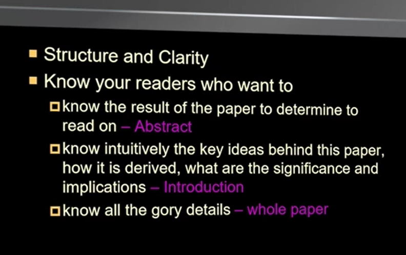

# Papers_form

## **关于读论文** (**重要**)

1. **Abstract** ： 这篇论文解决的什么样问题、主体的模型用的什么方法、取得的什么样的效果
    * 阅读文章前必须要精读的部分，一定要弄清楚这篇文章 在做什么 用什么方法 效果怎么样
2. **Introduction** : 引言部分会介绍与本文相关的方法，进而引出之前方法的缺陷
3. **Background** : 介绍其他解决缺陷的方法，**但**同时也存在着缺陷
    * Introduction和Background部分 是对摘要的进一步的扩充，继续写之前的state-of-art的经典模型是怎么去解决问题的，算法发展的脉络是怎么样的，以及他们对应的优缺点。
    * 这两部分在最初读论文时是不需要去着重关注的。
4. **Model Architecture** ： 介绍模型完完全全的架构
    * 一定要精读的部分，拿笔手推一下公式，这样才能有所收获、有所深刻理解。
    * 本文(Transformer)还单独拎出了两个部分
    * 1 Why Self-Attention ： 进一步从几个角度来进行模型和其他模型的比较
    * 2 Training : 介绍训练技巧，这部分适合复现的时候再精读
5. **Experiment Setting** : 用了什么数据集，模型训练,做了哪几种配置的实验
6. **Results** ：实现效果，不同角度、不同的配置设置，说明不同角度的能力，与之前的比较提升
7. **Conclusion** ： 总结优点，展望
8. **References** ： 参考文献
9. **Appendix** ： 附录

> **读论文最好的方式**
>
> **不要断断续续，要连续的时间内按照自己的节奏来读论文**

* **从整体到细节**

1. **了解大意**
    1. Abstract
    2. Model Architecture
2. **复现论文**
    1. Abstract
    2. Model Architecture
3. **分析**
    1. Why Self-Attention
    2. Appendix
4. **背景学习**
    1. Introduction
    2. Background

## 常用短语

English | 译文
:-: | :-:
**approach** | 很常用！表示我提出的方法或者以前的解决办法。
**approach to** | 同上表示我提出的方法或者以前的解决办法。
**state-of-the-art** | （adj. ）最先进的；已经发展的；达到最高水准的
**propose / be proposed recently by ...** | 1. 用来说明自己提出的方法  we propose a novel architecture   / We evaluate the proposed approach  on the task of   2. 用来表示别人某时已经发表的  an RNN Encoder–Decoder which was proposed recently by Cho et al. (2014a)
**As clearly visible from Fig.2 ...** | 从图2中可以清晰的看到
**Align ... to ...** | 将...与...对齐
**... in case of the latter** | 后者...
become **an integral part of** ... | 不可或缺的一部分
**in conjunction with** | 与...协力/配合
**the ... follows this owerall architecture ...** | ... 遵循这种整体架构 ...
**map ... to ...** | 将...映射到...
**instead of ... , we found it beneficial to ...** | 相比于...来说，...更好

## 常用句式

English | 译文
:-: | :-:
... **is a recently proposed approach to** | ... 某个方法是最近刚刚提出的、用来解决某任务的

## 关于复现论文

* 寻找资源
* 配置环境
* 运行结果
* 分析代码

## Course

### 1

#### ABSTRACT  

#### 1 INTRODUCTION  

#### 2 BACKGROUND: NEURAL MACHINE TRANSLATION  

#### 3 LEARNING TO ALIGN AND TRANSLATE  

#### 4 EXPERIMENT SETTINGS  

#### 5 RESULTS  

#### 6 RELATED WORK  

#### 7 CONCLUSION  

#### ACKNOWLEDGMENTS  

#### REFERENCES
