# Word2Vector 核心 - CBOW & Skip-gram

> 由于NNLM计算复杂度太大。Word2Vector 就是一种 简化版的神经网络语言模型。 通过语言模型来获取词向量。

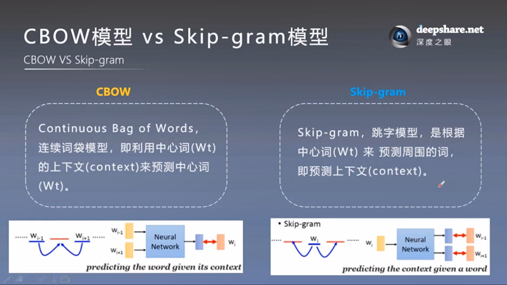

## CBOW模型（Continuous Bag of Words)连续词袋模型

> 已知上下文，来预测中心词的概率，求最大似然

* 投影层采用求和平均来取代拼接
* 双向上下文--上下文词序就没有影响了
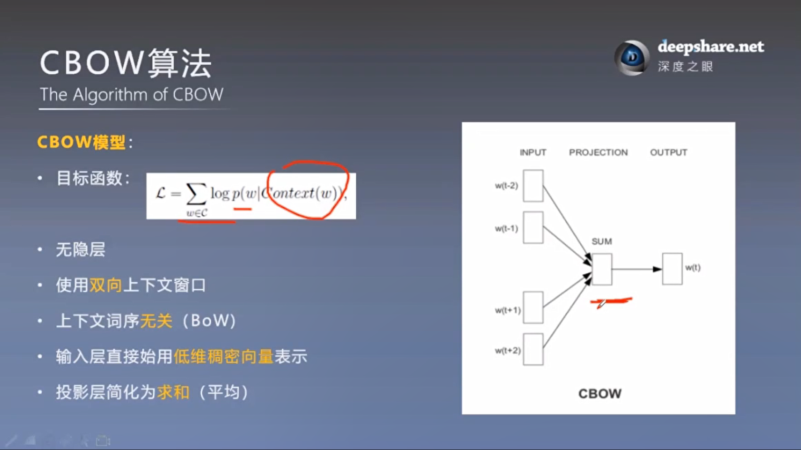

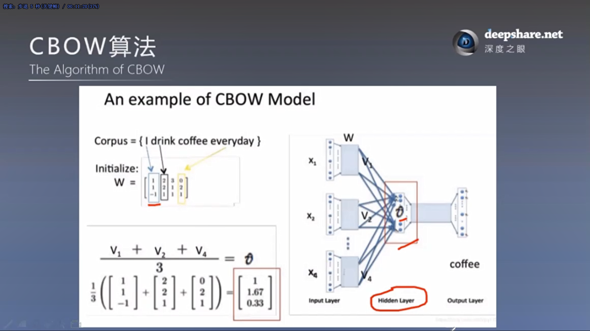

第二层的W'是n*V维的，输出就是V维的，代表需要预测的词对应词库中每一个词的概率。

这个例子里只有4个词。
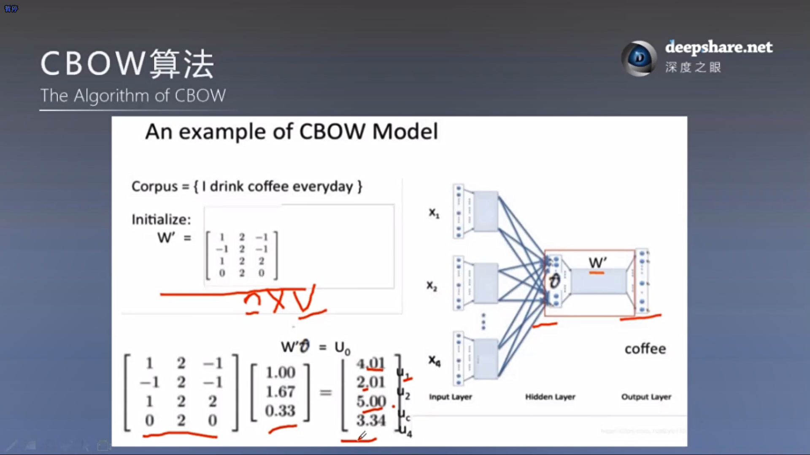

下一层采用softmax激活，选择最大的概率，这里是第三个coffee最大。

接下来需要反向传播，损失函数的依据就是这次的预测输出和本来正确的监督标签coffee对应的One-Hot表示。这里就是 [0.23, 0.03, 0.62, 0.12] 和 [0, 0, 1, 0] 对比计算损失。反向传播+随机梯度下降。
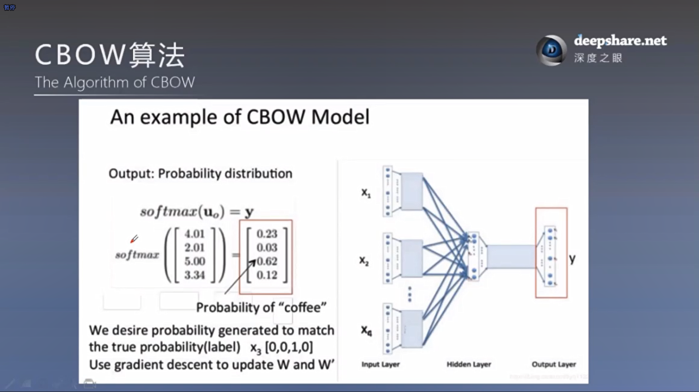

### 继续优化加速训练

* 采用了 层次softmax（Hierarachial Softmax） 和 负采样（Negetive Sampling）
* 层次softmax利用哈夫曼树相关知识
* 另外两篇论文介绍
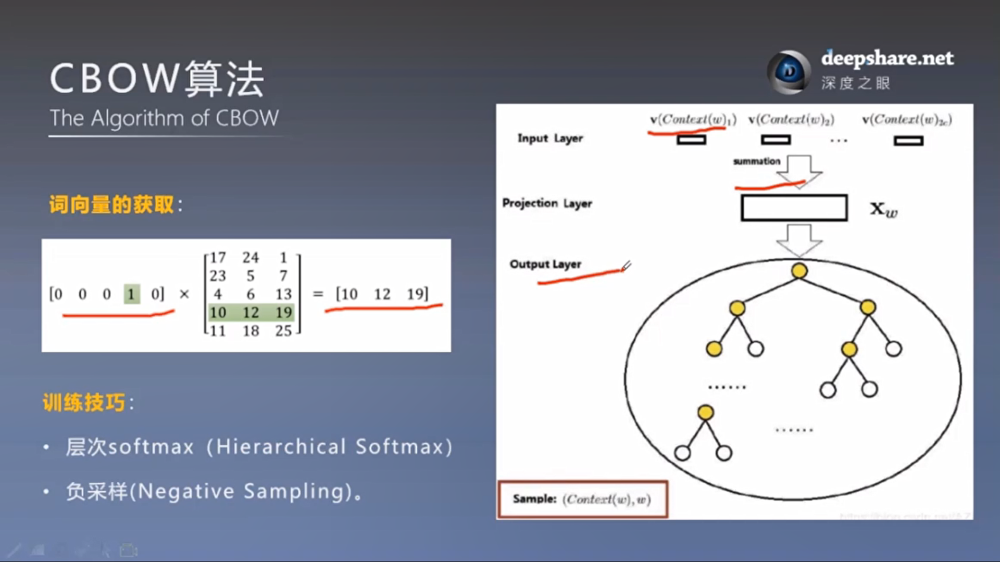

## Skip-gram模型（Skip-gram）跳字模型

> 已知中心词，求上下文

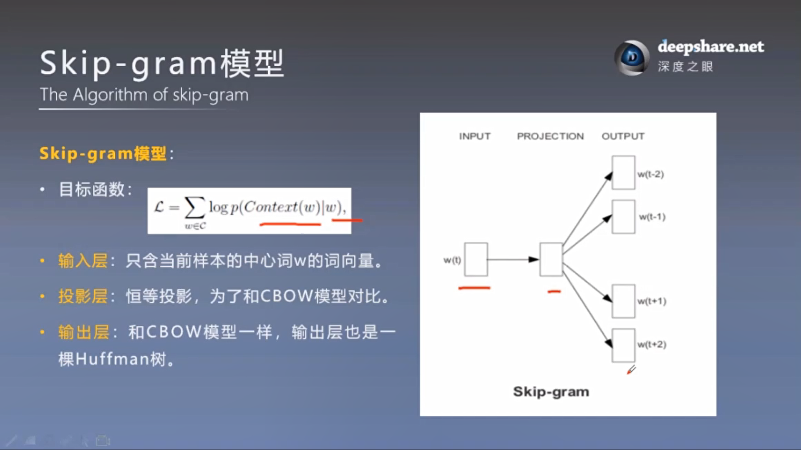

* 两个概念
* skip_window = 2
* num_skips = 2
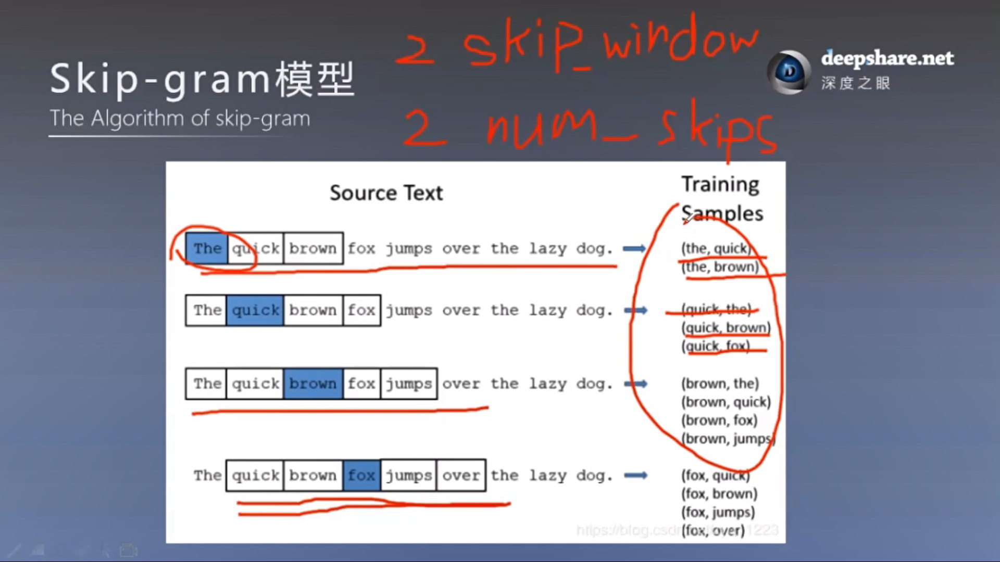

过程

D×V维 * V×1维 -> D×1维
（某个词的One-Hot * 词向量矩阵 得到 这个词对应的稠密词向量）

Q：W'是共用的 ，所以采用计算 最大交叉熵 优化所有条件概率的乘积

## 最大熵，最大交叉熵

* 最大熵原理认为，学习概率模型时，在所有可能的概率模型（分布）中，熵最大的模型是最好的模型。——李航《统计学习方法》
* 熵最大也就是数据是比较混乱的

* 最大熵模型是NLP常用的
* 模型需要满足已知条件，另外在未知的情况下，假设未知的概率都是平均的

* 对偶函数的极大化等价于最大熵模型的极大似然估计。——李航《统计学习方法》
* 最大熵模型的学习问题可以转化为具体求解对数似然函数极大化 或 对偶函数极大化的问题。——李航《统计学习方法》

[深度学习中交叉熵和KL散度和最大似然估计之间的关系: 机器学习的面试题中经常会被问到交叉熵(cross entropy)和最大似然估计(MLE)或者KL散度有什么关系，查了一些资料发现优化这3个东西其实是等价的。](https://www.cnblogs.com/arkenstone/p/10524720.html)

下图的需要注意的是，多个 softmax回归分类器 之间是不相干的，训练后的最终输出所以是不一样的，上下文。

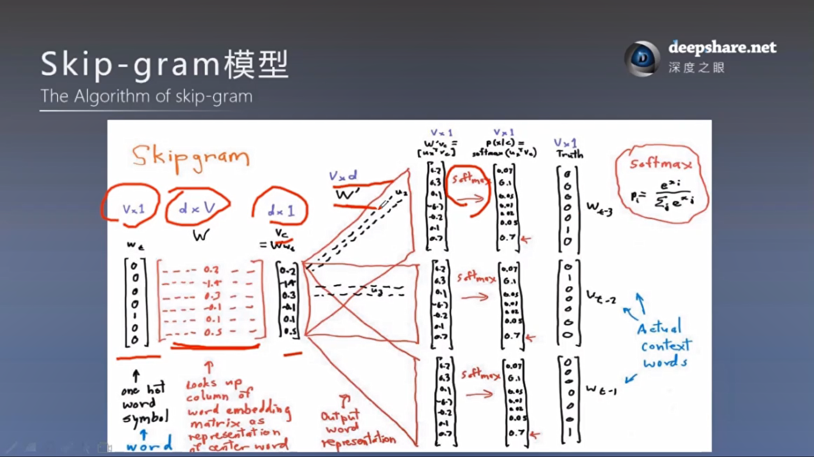

[一文详解 Word2vec 之 Skip-Gram 模型（结构篇）](https://blog.csdn.net/qq_24003917/article/details/80389976)

## 实验和结果

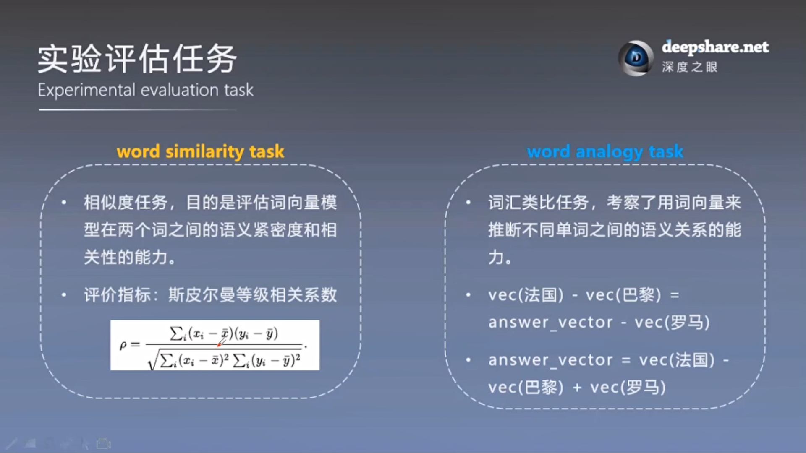
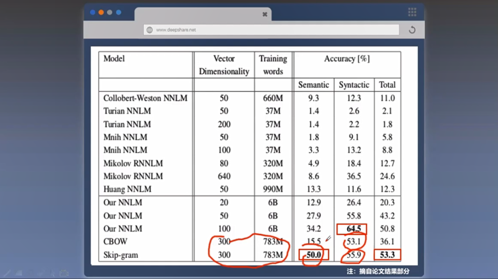

Q： 为什么跳字模型明显好于连续词袋模型

大规模语料加高强度下，CBOW在语义上开始并不弱于Skip-gram了
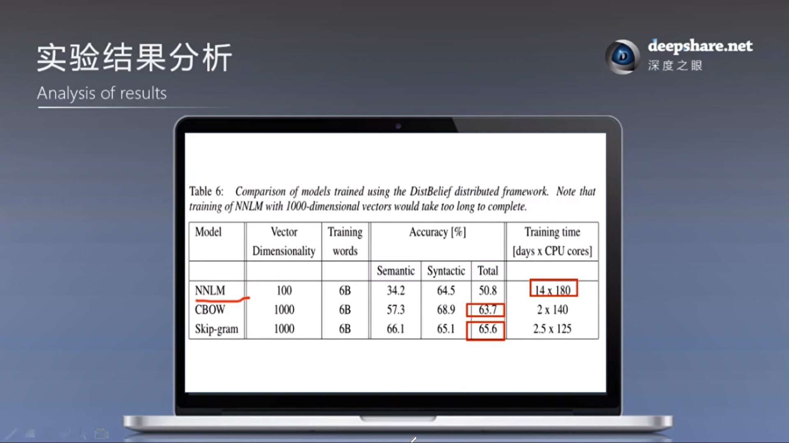

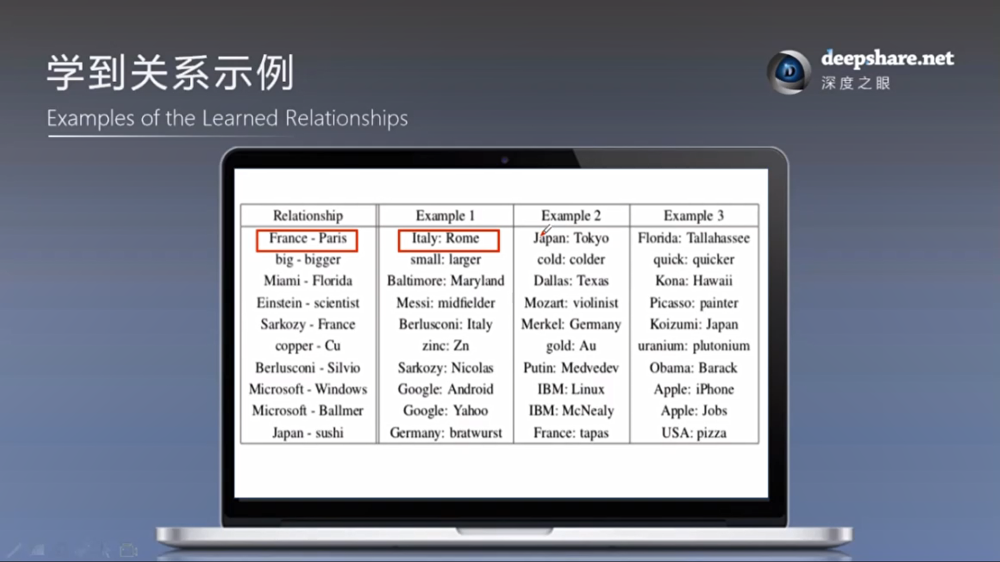

## 讨论和总结

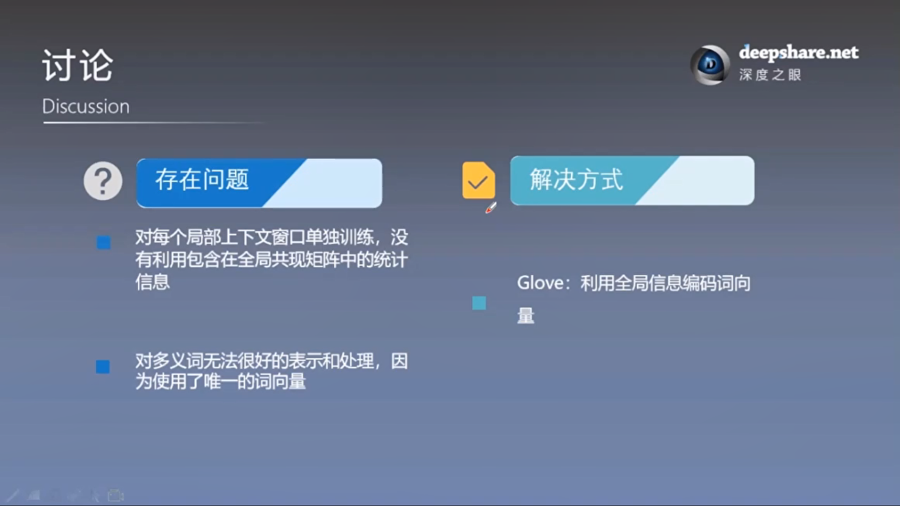
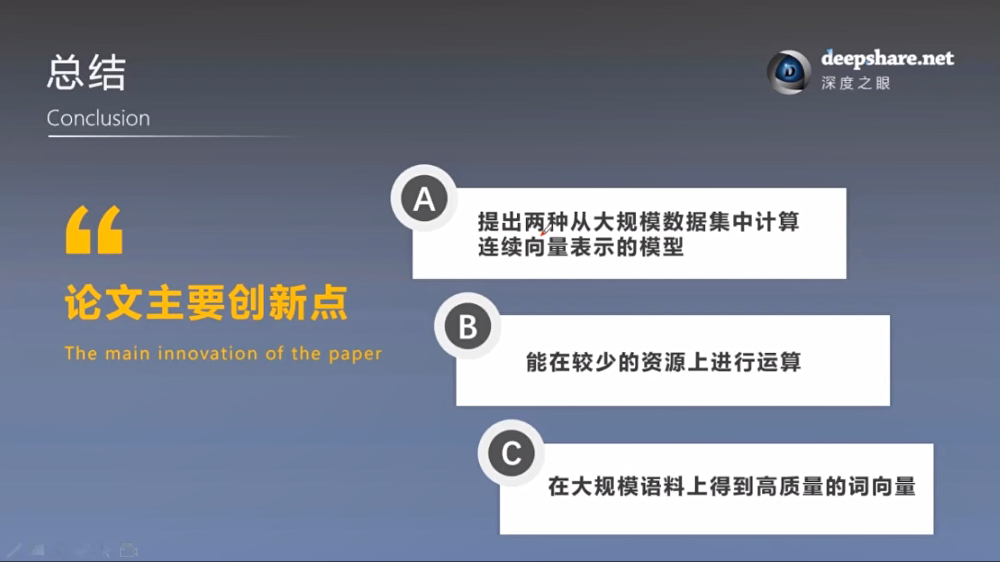

## JASON包

> 可以自动TF-IDF、word2vec训练等
>
> scikit-learn也自带
