# Transla_attention

> 机器翻译 注意力机制

端到端

深度学习 表示学习

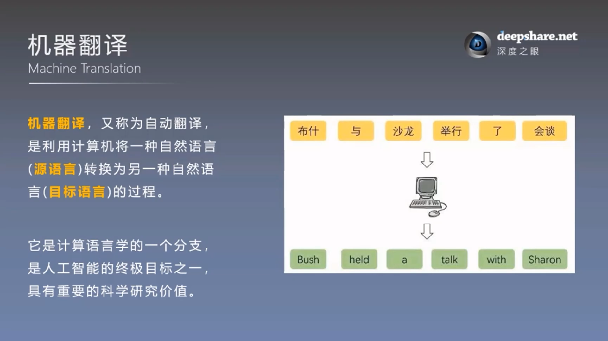

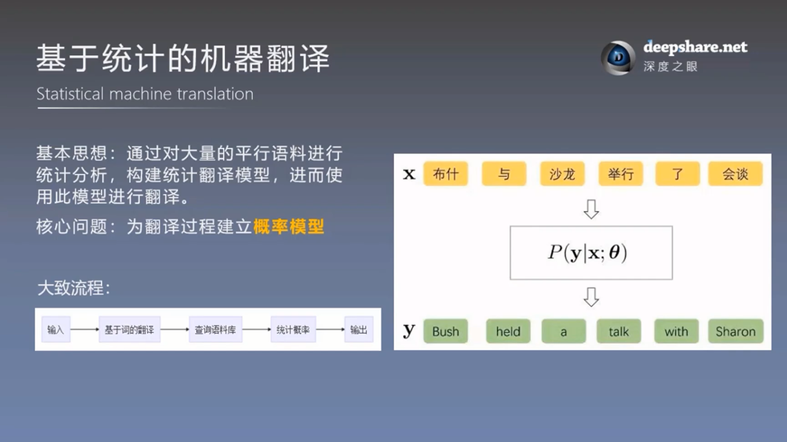
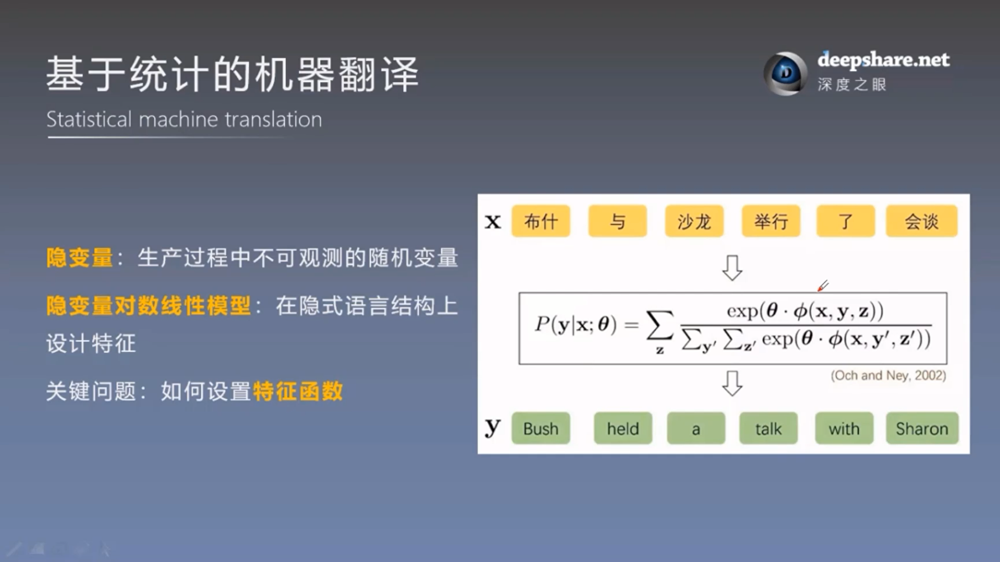
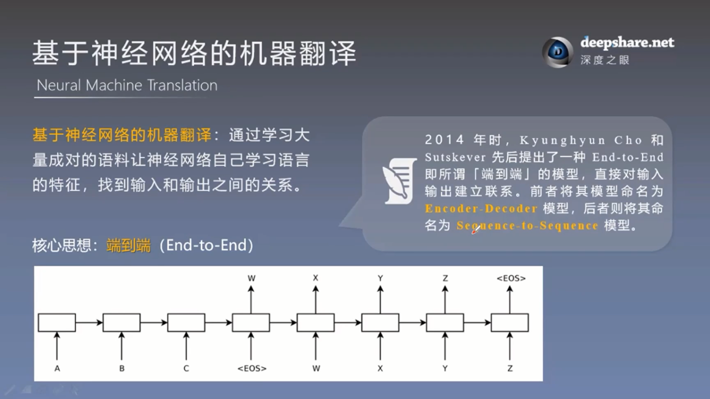

相关技术
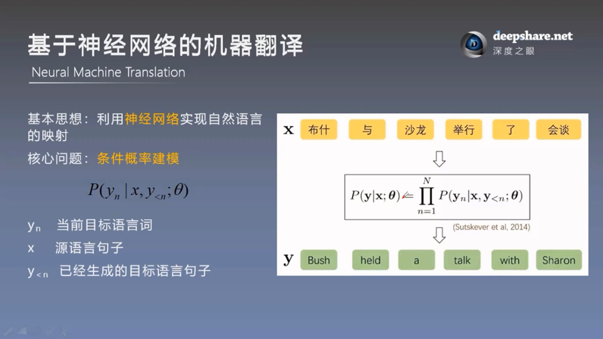
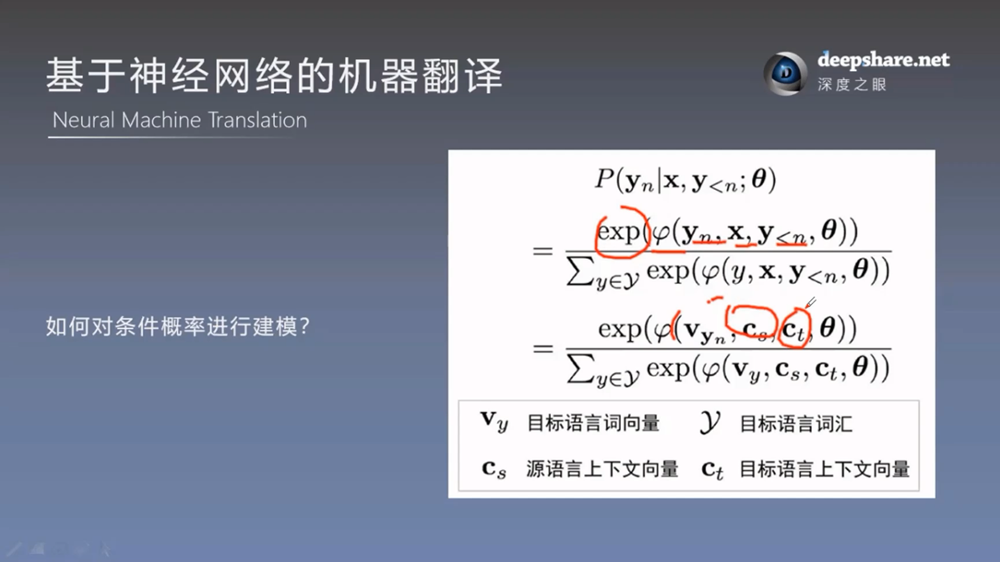
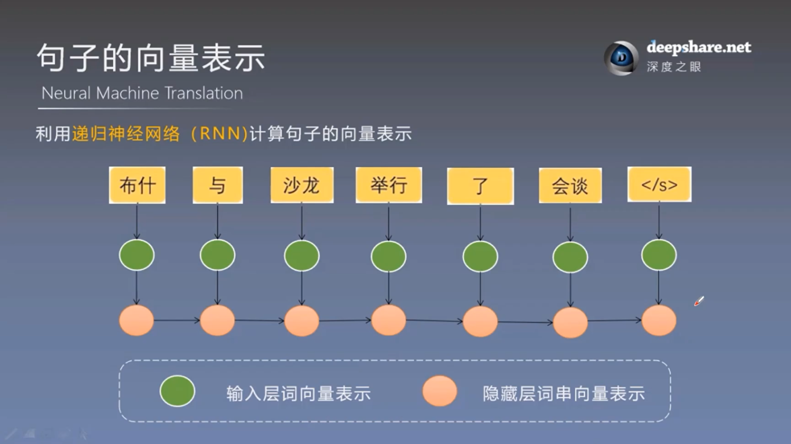

* 从上图是利用RNN来得到一种句子的向量表示。到最后的节点（实际上就是那一个节点，不断在循环而已，所以）就存储了整个句子的所有信息。
* 深度学习带给我们的 **革命性的变化** 就是 **信息的表达的方式** 。
* 机器翻译的核心就是不同语言之间的等价转换。
* 传统上，我们习惯了用**离散表示**，用词、短句、句法树。
* 深度学习强调的是，我们用**连续的表示**， 用**数字**。

## Encoder Decoder 编码器-解码器框架

* 从最后包含整个句子信息的节点中 把信息再分别解码出来。

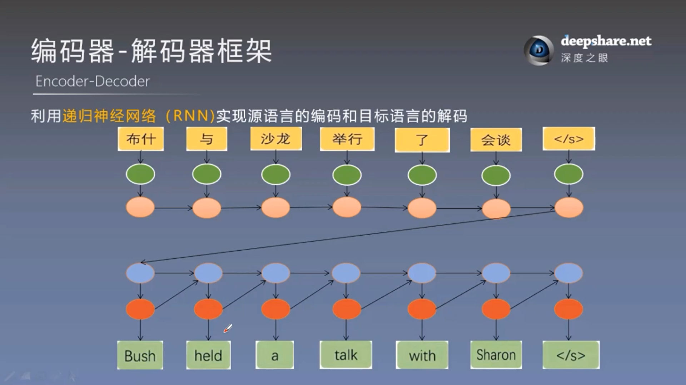
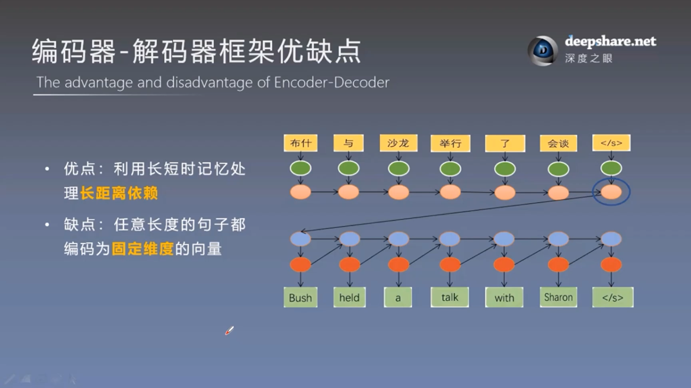
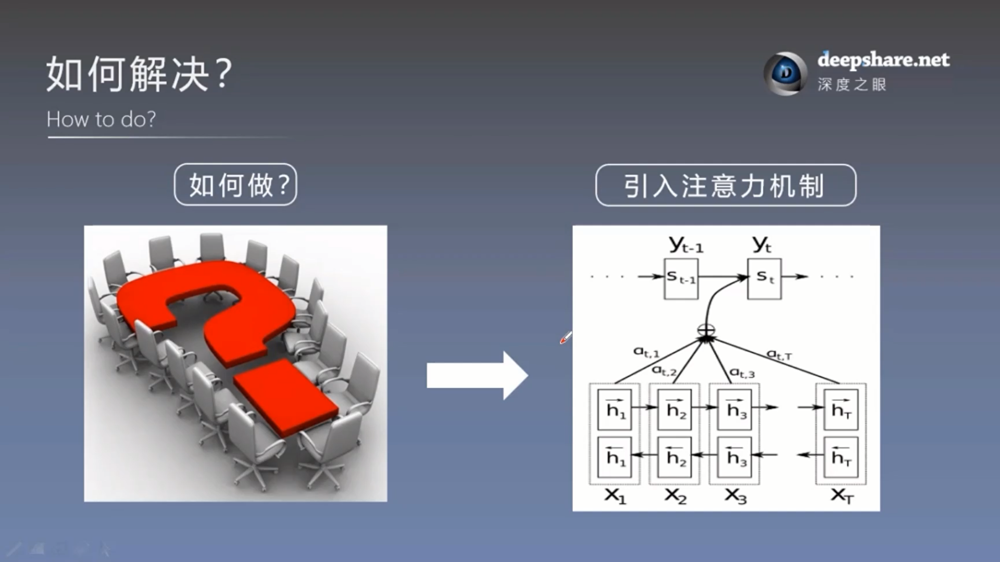
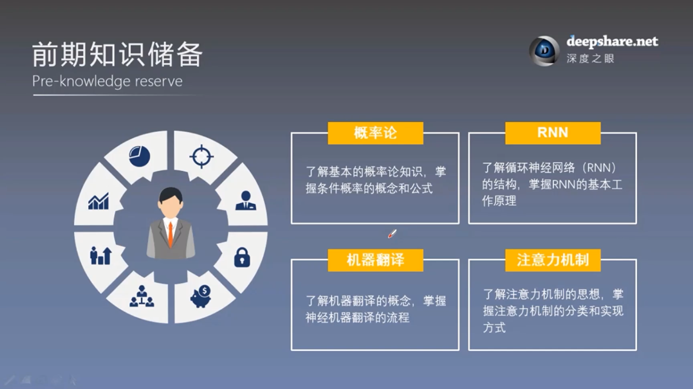
