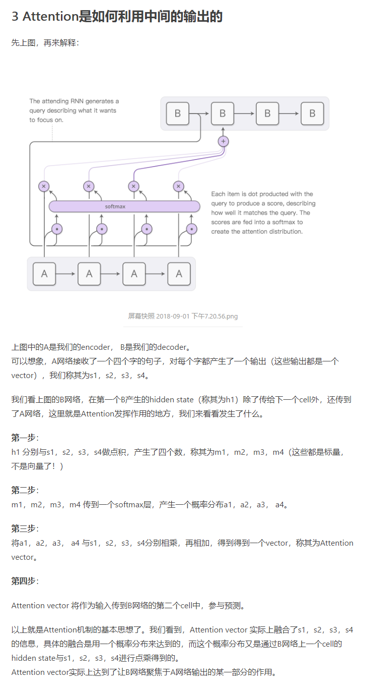
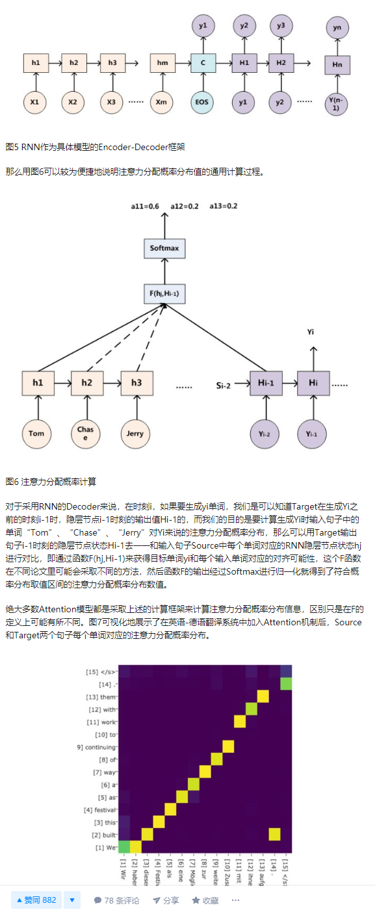
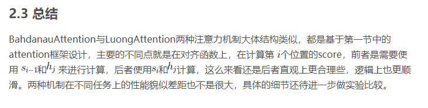
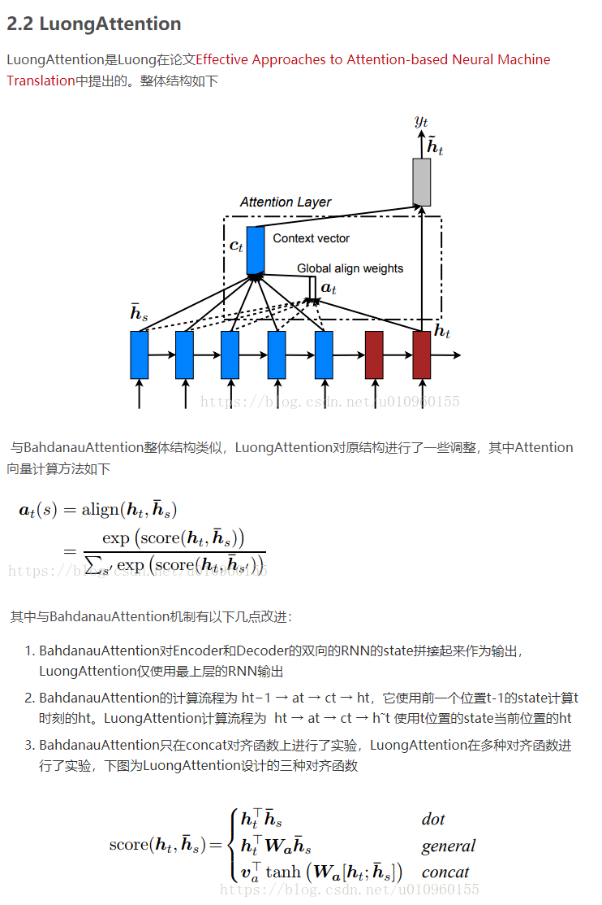

# 注意力机制的核心——软对齐模型 理解

> 注意力机制的核心其实是一个对齐模型，但是讲解视频讲得不好，论文描述也不好懂，所以造成了一些理解的困难，这里来重点梳理一下。

在生成下一个目标词之前，我们需要一个上下文向量contact_vector和一个已经生成的目标序列，而且contact_vector是带有注意力机制的，是只是一个加权平均。
在生成yi之前，已有解码器的上一个状态Hi-1，也已有编码器的所有隐藏输出状态，所以score打分一下现在的状态到底与哪一些源语言部分更加相关，也就是翻译下一个词时**不能**笼统地认为下一个词与contact_vector的所有部分全部**均等**的相关，而是 **生成下一个单词时、哪一些单词对这个单词的生成是最有价值的**，这个很重要，是核心思想。

这个是我认为最好的解释 [milter: 机器学习面试之Attention](https://www.jianshu.com/p/c94909b835d6)

其他参考资料还有：

[真正的完全图解Seq2Seq Attention模型](https://zhuanlan.zhihu.com/p/40920384)

[深度学习中的注意力模型（2017版）](https://zhuanlan.zhihu.com/p/37601161)

## 对齐模型

> 对齐模型一般有两种

差别就在于对齐的时候选择的source语句的hidden_states不同

[BahdanauAttention与LuongAttention注意力机制简介](https://blog.csdn.net/u010960155/article/details/82853632)

我其实喜欢后者，但是实现也会稍难，还需要研究

[LuongAttention注意力 论文 ：Effective Approaches to Attention-based Neural Machine Translation](Effective_Approaches_to_Attention-based_Neural_Machine_Translation.pdf)
