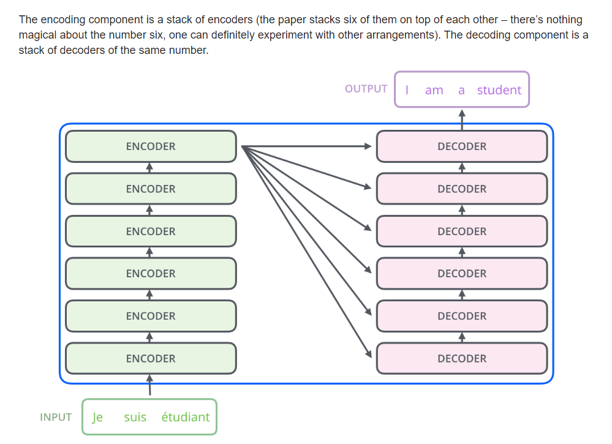
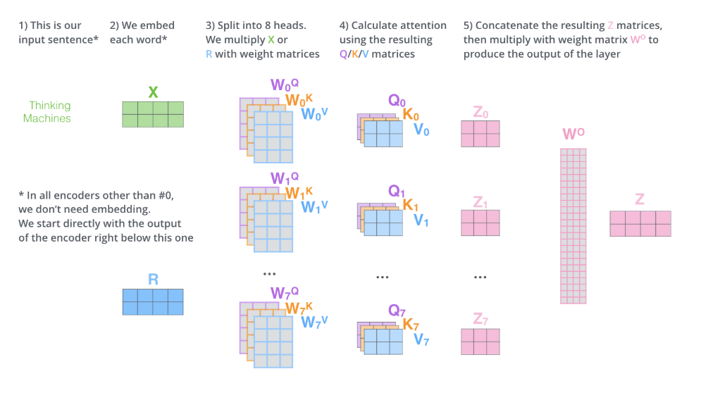

# Transformer

> Transfomer 出发点：
>
> 早期Attention机制与RNN结合在机器翻译中的效果，RNN由于其顺序结构训练速度常常受到限制，既然Attention模型本身可以看到全局的信息， 那么一个自然的疑问是我们能不能去掉RNN结构，仅仅依赖于Attention模型呢，这样我们可以使训练并行化，同时拥有全局信息？

* 转导模型

[转导推理——Transductive Learning](https://www.cnblogs.com/siegfang/p/3424003.html)
* 文章多次提到转导模型

