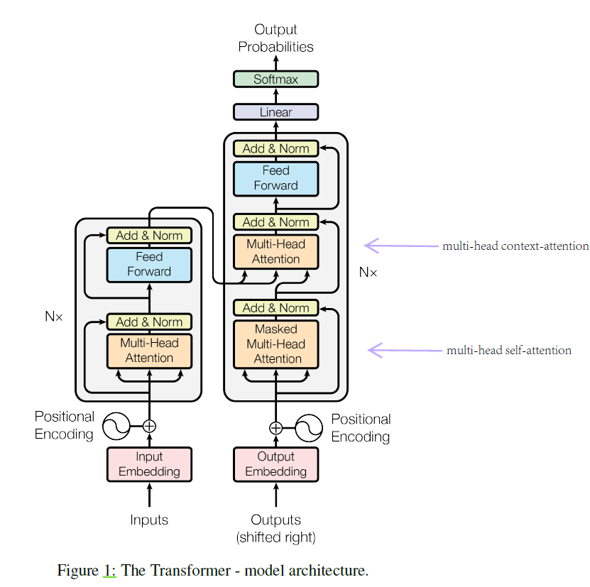
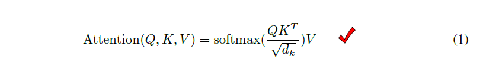
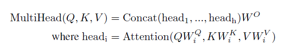
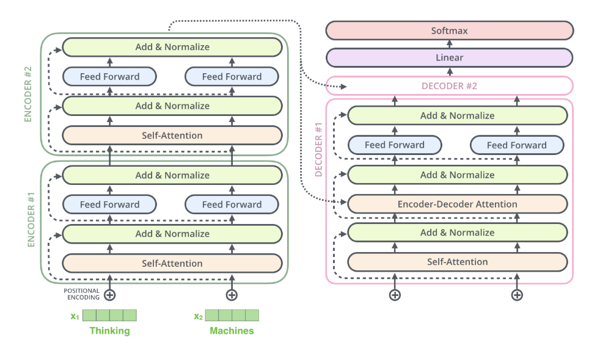
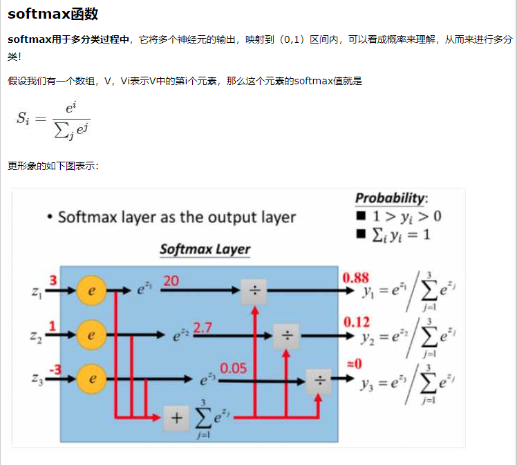

# Transformer

> Transfomer 出发点：
>
> 早期Attention机制与RNN结合在机器翻译中的效果，RNN由于其顺序结构训练速度常常受到限制，既然Attention模型本身可以看到全局的信息， 那么一个自然的疑问是我们能不能去掉RNN结构，仅仅依赖于Attention模型呢，这样我们可以使训练并行化，同时拥有全局信息？

* 转导模型

[转导推理——Transductive Learning](https://www.cnblogs.com/siegfang/p/3424003.html)

关于Transfomrer很好的介绍：

[Attention机制详解（二）——Self-Attention与Transformer](https://zhuanlan.zhihu.com/p/47282410)

这篇知乎很多借鉴了一个极其出色的国外的transformer可视化的博客文章，很详细且十分形象

[The Illustrated Transformer （by  Jay Alammar）](https://jalammar.github.io/illustrated-transformer/)

* 文章多次提到转导模型

* 多头自注意力 multi-head attention

* softmax

[详解softmax函数以及相关求导过程](https://zhuanlan.zhihu.com/p/25723112)
