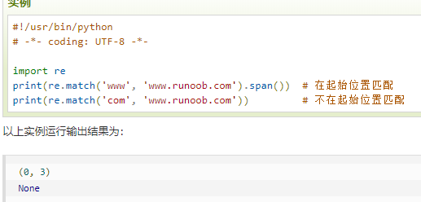
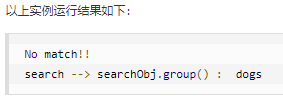
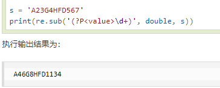
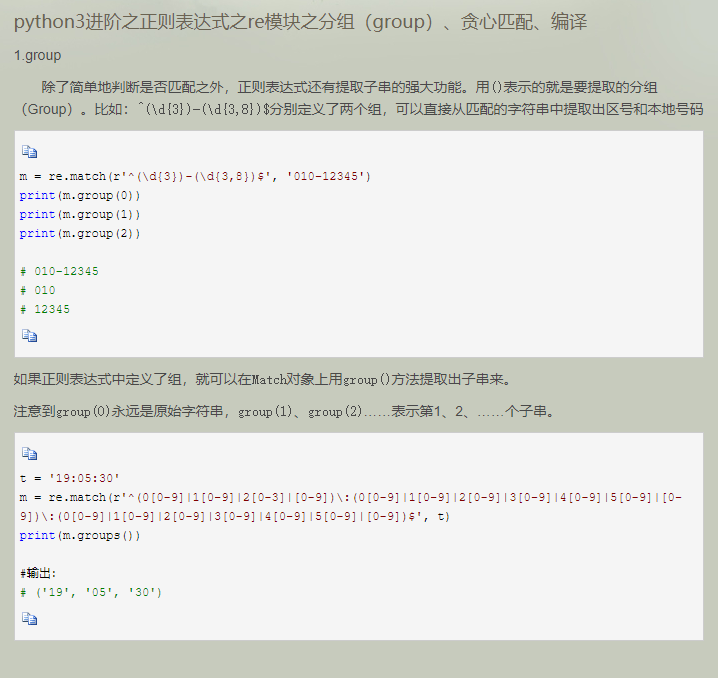
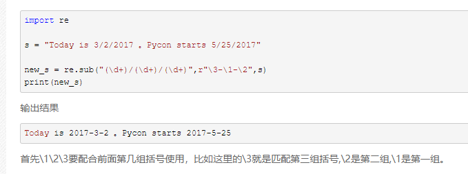

# 正则表达式

> [正则表达式 - 语法](https://www.runoob.com/regexp/regexp-syntax.html)
>
> [Python 正则表达式](https://www.runoob.com/python/python-reg-expressions.html)
>
> [Python3 正则表达式](https://www.runoob.com/python3/python3-reg-expressions.html)
>
> **[JavaScript 正则表达式](https://developer.mozilla.org/zh-CN/docs/Web/JavaScript/Guide/Regular_Expressions)**

1. [一日一技：请不要再用re.compile了！！！](https://cloud.tencent.com/developer/article/1453417)，技术的进化，日新月异啊，附：[正则表达式 re.compile()](https://blog.csdn.net/Darkman_EX/article/details/80973656)
2. re.match函数
re.match 尝试从字符串的起始位置匹配一个模式，如果不是起始位置匹配成功的话，match()就返回none。

3. re.match与re.search的区别
re.match只匹配字符串的开始，如果字符串开始不符合正则表达式，则匹配失败，函数返回None；而re.search匹配整个字符串，直到找到一个匹配。
    #!/usr/bin/python
    import re
    line = "Cats are smarter than dogs";
    matchObj = re.match( r'dogs', line, re.M|re.I)
    if matchObj:
    print "match --> matchObj.group() : ", matchObj.group()
    else:
    print "No match!!"
    matchObj = re.search( r'dogs', line, re.M|re.I)
    if matchObj:
    print "search --> searchObj.group() : ", matchObj.group()
    else:
    print "No match!!"

4. 检索和替换
Python 的 re 模块提供了re.sub用于替换字符串中的匹配项。
re.sub(pattern, repl, string, count=0, flags=0)
5. repl 参数是一个函数
以下实例中将字符串中的匹配的数字乘以 2：

6. [python3进阶之正则表达式之re模块之分组（group）、贪心匹配、编译](https://www.cnblogs.com/max520liuhu/p/8934491.html)

7. [正则中的\1\2\3问题](https://www.cnblogs.com/c-x-a/p/11002041.html)

8. [正则 ?<= 和 ?= 用法](https://www.cnblogs.com/whaozl/p/5462865.html)

模式 | 描述
:-: | :-:
^ | 匹配字符串的开头
$ | 匹配字符串的末尾。
. | 匹配任意字符，除了换行符，当re.DOTALL标记被指定时，则可以匹配包括换行符的任意字符。
[...] | 用来表示一组字符,单独列出：[amk] 匹配 'a'，'m'或'k'
[^...] | 不在[]中的字符：[^abc] 匹配除了a,b,c之外的字符。
re* | 匹配0个或多个的表达式。
re+ | 匹配1个或多个的表达式。
re? | 匹配0个或1个由前面的正则表达式定义的片段，非贪婪方式
re{ n} | n 是一个非负整数。匹配确定的 n 次。精确匹配 n 个前面表达式。例如， o{2} 不能匹配 "Bob" 中的 "o"，但是能匹配 "food" 中的两个 o。
re{ n,} | n 是一个非负整数。至少匹配n 次。匹配 n 个前面表达式。例如， o{2,} 不能匹配"Bob"中的"o"，但能匹配 "foooood"中的所有 o。"o{1,}" 等价于 "o+"。"o{0,}" 则等价于 "o*"。
re{ n, m} | m 和 n 均为非负整数，其中n <= m。最少匹配 n 次且最多匹配 m 次。匹配 n 到 m 次由前面的正则表达式定义的片段，贪婪方式。'o{0,1}' 等价于 'o?'。请注意在逗号和两个数之间不能有空格。
a\|b | 匹配a或b
(re) | 对正则表达式分组并记住匹配的文本
(?imx) | 正则表达式包含三种可选标志：i, m, 或 x 。只影响括号中的区域。
(?-imx) | 正则表达式关闭 i, m, 或 x 可选标志。只影响括号中的区域。
(?: re) | 类似 (...), 但是不表示一个组
(?imx: re) | 在括号中使用i, m, 或 x 可选标志
(?-imx: re) | 在括号中不使用i, m, 或 x 可选标志
(?#...) | 注释.
(?= re) | 前向肯定界定符。如果所含正则表达式，以 ... 表示，在当前位置成功匹配时成功，否则失败。但一旦所含表达式已经尝试，匹配引擎根本没有提高；模式的剩余部分还要尝试界定符的右边。
(?! re) | 前向否定界定符。与肯定界定符相反；当所含表达式不能在字符串当前位置匹配时成功
(?> re) | 匹配的独立模式，省去回溯。
\w | 匹配字母数字及下划线
\W | 匹配非字母数字及下划线
\s | 匹配任意空白字符，等价于 [\t\n\r\f].
\S | 匹配任意非空字符
\d | 匹配任意数字，等价于 [0-9].
\D | 匹配任意非数字
\A | 匹配字符串开始
\Z | 匹配字符串结束，如果是存在换行，只匹配到换行前的结束字符串。
\z | 匹配字符串结束
\G | 匹配最后匹配完成的位置。
\b | 匹配一个单词边界，也就是指单词和空格间的位置。例如， 'er\b' 可以匹配"never" 中的 'er'，但不能匹配 "verb" 中的 'er'。
\B | 匹配非单词边界。'er\B' 能匹配 "verb" 中的 'er'，但不能匹配 "never" 中的 'er'。
\n, \t, 等. | 匹配一个换行符。匹配一个制表符。等
\1...\9 | 匹配第n个分组的内容。
\10 | 匹配第n个分组的内容，如果它经匹配。否则指的是八进制字符码的表达式。

正则表达式实例

实例 | 描述
:-: | :-:
python | 匹配 "python".
[Pp]ython | 匹配 "Python" 或 "python"
rub[ye] | 匹配 "ruby" 或 "rube"
[aeiou] | 匹配中括号内的任意一个字母
[0-9] | 匹配任何数字。类似于 [0123456789]
[a-z] | 匹配任何小写字母
[A-Z] | 匹配任何大写字母
[a-zA-Z0-9] | 匹配任何字母及数字
[^aeiou] | 除了aeiou字母以外的所有字符
[^0-9] | 匹配除了数字外的字符
. | 匹配除 "\n" 之外的任何单个字符。要匹配包括 '\n' 在内的任何字符，请使用象 '[.\n]' 的模式。
\d | 匹配一个数字字符。等价于 [0-9]。
\D | 匹配一个非数字字符。等价于 [^0-9]。
\s | 匹配任何空白字符，包括空格、制表符、换页符等等。等价于 [ \f\n\r\t\v]。
\S | 匹配任何非空白字符。等价于 [^ \f\n\r\t\v]。
\w | 匹配包括下划线的任何单词字符。等价于'[A-Za-z0-9_]'。
\W | 匹配任何非单词字符。等价于 '[^A-Za-z0-9_]'。
