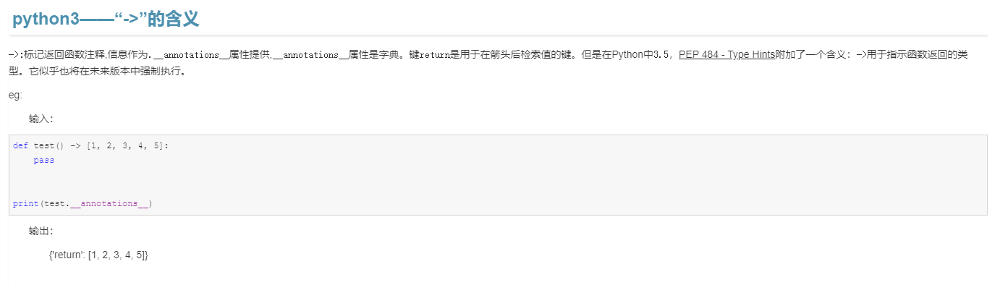

# python 小项目和tips等

## 小项目

* [准考证号“爆破”——解决忘记准考证号无法查询考研初始成绩（校官网）](https://github.com/dyngq/summary-notebooks-of-postgraduate/tree/master/Python/burst_number)
* 小脚本：批处理提取word信息到excel

## tips

## 一些python小知识积累

* 深拷贝与浅拷贝
* Python中*args和**kwargs的区别 ： [参考链接](https://www.cnblogs.com/yunguoxiaoqiao/p/7626992.html)
* [python numpy 常用随机数的产生方法](https://blog.csdn.net/m0_37804518/article/details/78490709)
* [ln -s 软链接知识总结](https://www.cnblogs.com/hxy5/p/9460063.html)

* python3——“->”的含义 ： ->用于指示函数返回的类型

