# 基础总结

## 线性回归

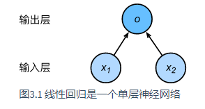

## softmax回归

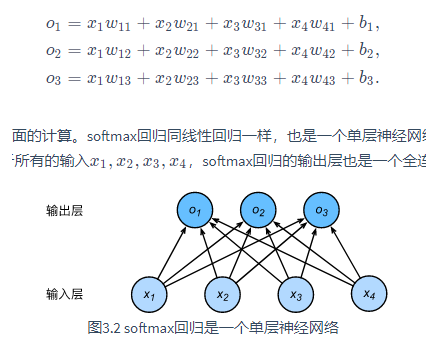

* P.S. sigmoid适合二分类，而softmax适合多分类，softmax将输出映射到和为1的概率分布当中

## **！！ 交叉熵损失函数 ！！**

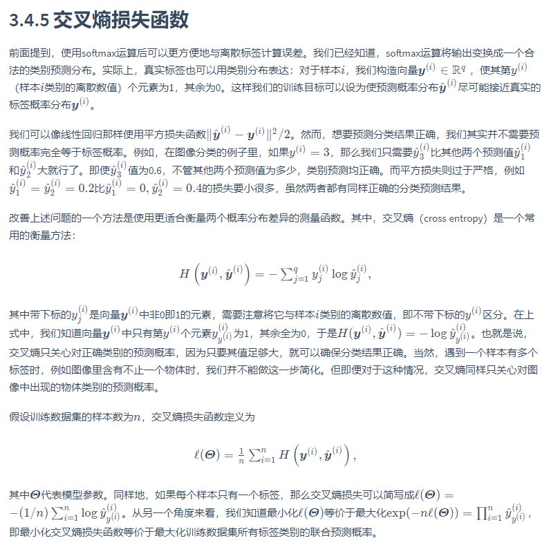

## 初始化权重

[pytorch nn.init 中实现的初始化函数 uniform, normal, const, Xavier, He initialization](https://blog.csdn.net/dss_dssssd/article/details/83959474)
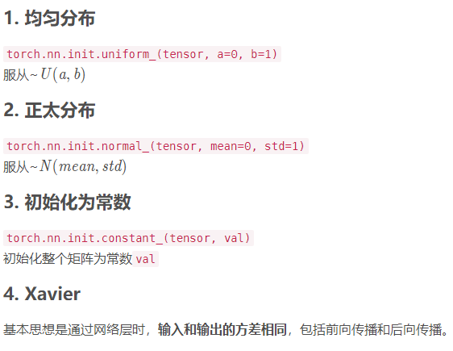

## 多层感知机

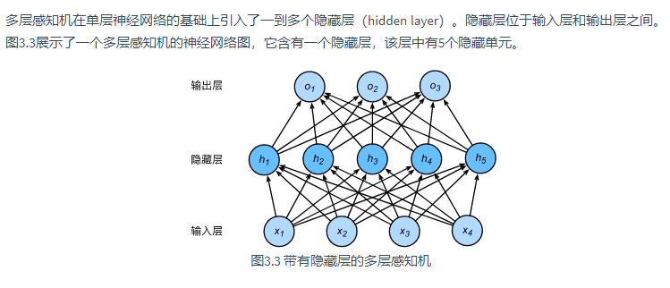
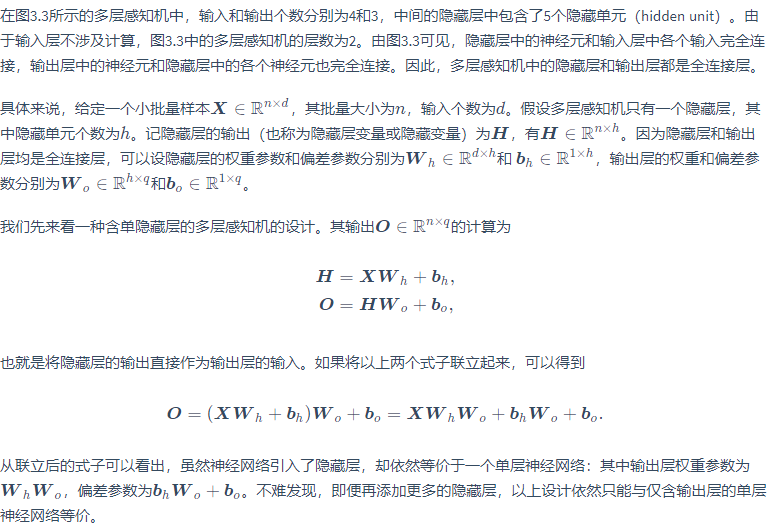

## 激活函数

上述问题的根源在于全连接层只是对数据做仿射变换（affine transformation），而多个仿射变换的叠加仍然是一个仿射变换。解决问题的一个方法是引入非线性变换，例如对隐藏变量使用按元素运算的非线性函数进行变换，然后再作为下一个全连接层的输入。这个非线性函数被称为激活函数（activation function）。下面我们介绍几个常用的激活函数。

[sigmoid和softmax总结](https://blog.csdn.net/u014422406/article/details/52805924)

### 1 ReLU函数

ReLU（rectified linear unit）函数提供了一个很简单的非线性变换。给定元素xx，该函数定义为

**ReLU(x)=max(x,0).**

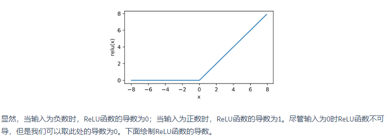
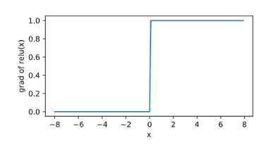

### 2 sigmoid函数

sigmoid函数可以将元素的值变换到0和1之间：

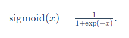

sigmoid函数在早期的神经网络中较为普遍，但它目前逐渐被更简单的ReLU函数取代。在后面“循环神经网络”一章中我们会介绍如何利用它值域在0到1之间这一特性来控制信息在神经网络中的流动。下面绘制了sigmoid函数。当输入接近0时，sigmoid函数接近线性变换。

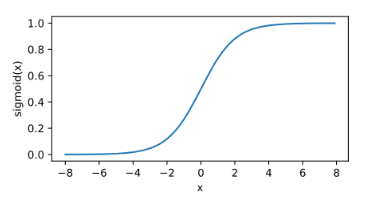
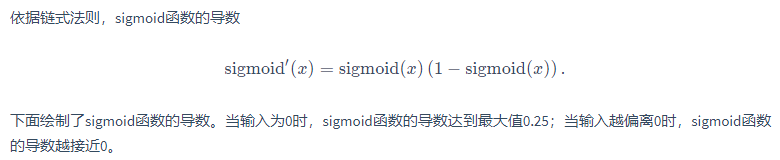
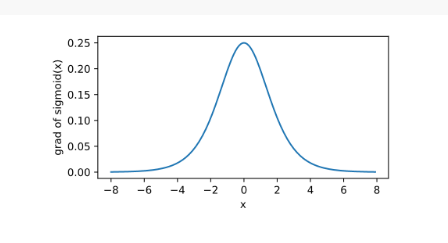

## tanh函数

tanh（双曲正切）函数可以将元素的值变换到-1和1之间：

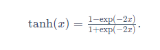

我们接着绘制tanh函数。当输入接近0时，tanh函数接近线性变换。虽然该函数的形状和sigmoid函数的形状很像，但tanh函数在坐标系的原点上对称。

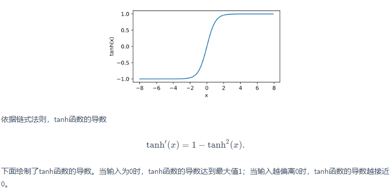

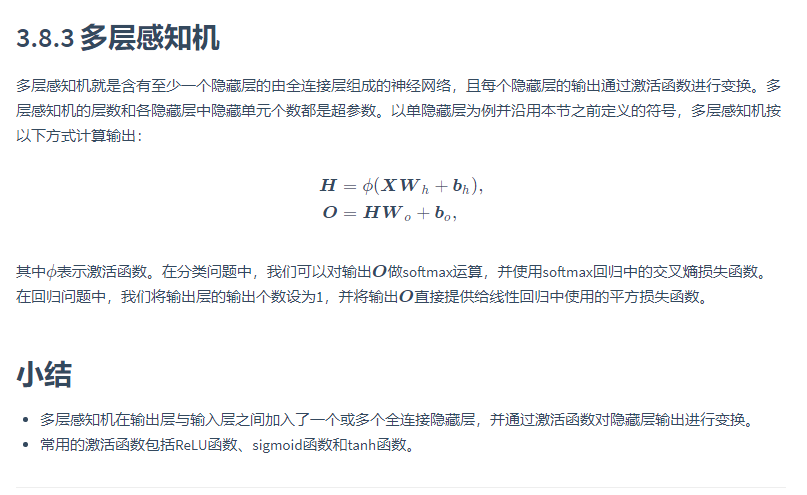
