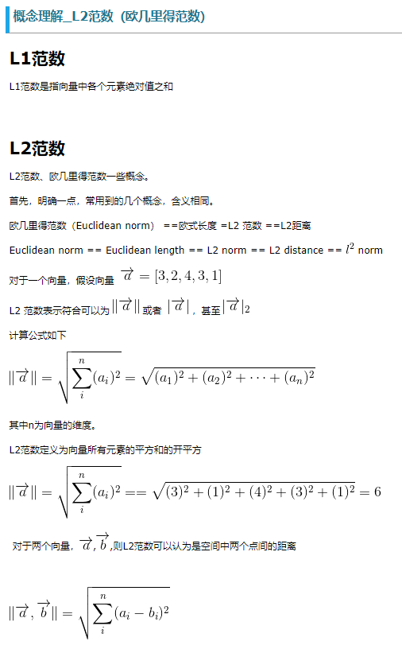
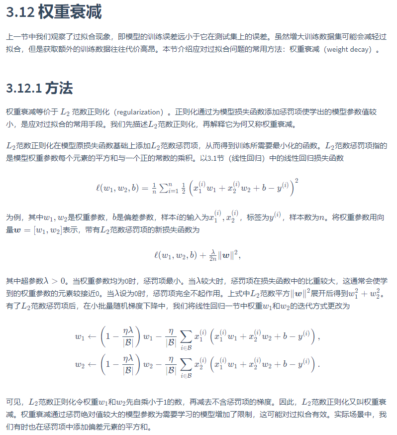

# 权重衰减 范数

## 权重衰减（weight decay）

权重衰减等价于 L2范数正则化（regularization）。正则化通过为模型损失函数添加惩罚项使学出的模型参数值较小，是应对过拟合的常用手段。我们先描述L2范数正则化，再解释它为何又称权重衰减。

## 范数

[如何通俗易懂地解释「范数」？](https://zhuanlan.zhihu.com/p/26884695)

## L2范数 正则化（regularization）

[图片来源](https://www.cnblogs.com/lhfhaifeng/p/10671349.html)

