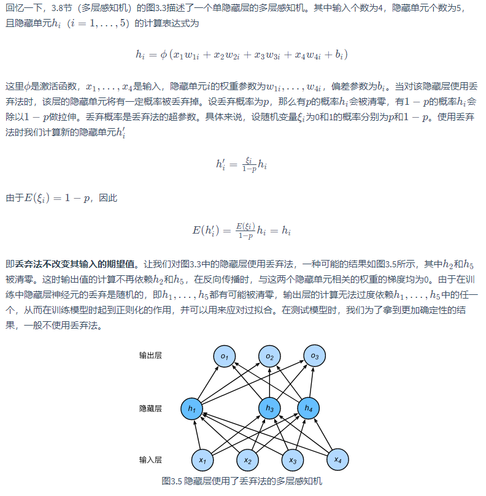

# Dropout

Dropout应该是很熟悉了，随机的丢弃部分权重，但是**需要注意的是**:

> 需要保证输出权重不变
>
> 所以并不是简单的丢弃，而是按照p概率丢弃，1-p概率下按照除以1-p的大小进行拉伸

具体如下：

[从头学pytorch：dropout防止过拟合](https://blog.csdn.net/c98136202zig/article/details/103785007)
