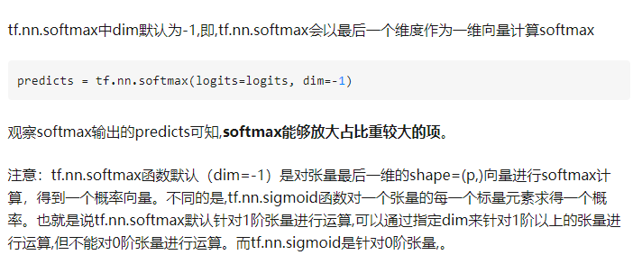
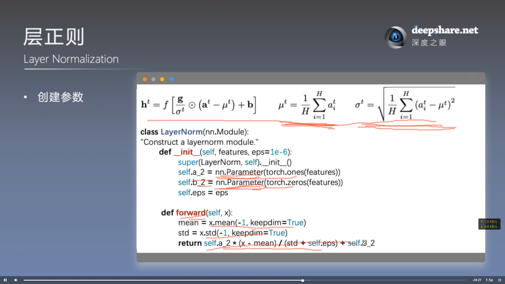
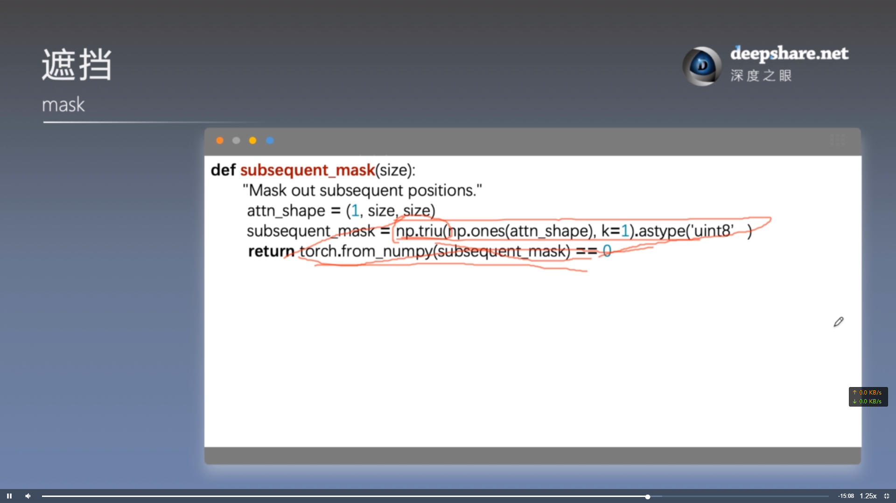
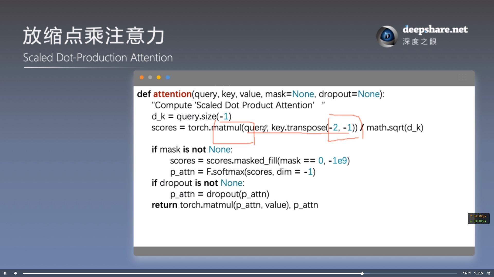
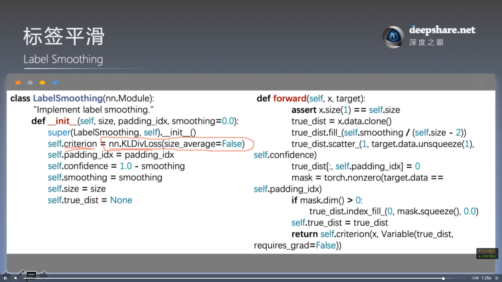
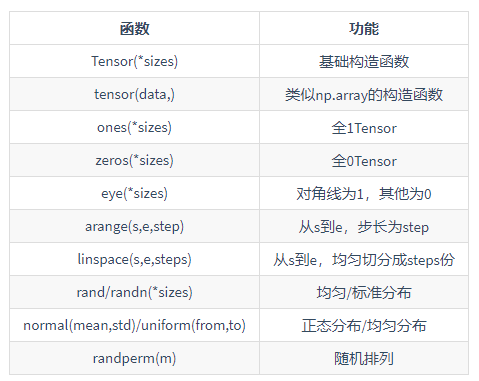

# pytorch基础

## 0x00 基础

### tensor基础

```python
import torch
torch.__version__
```


    '1.3.1'


```python
x = torch.rand(5, 3)
# print(x)
x = torch.zeros(5, 3, dtype=torch.long)
# print(x)
x = torch.tensor([5.5, 3])
# print(x)
x = torch.ones(5, 3, dtype=torch.double)


print(type(x.item))
print(x.size())
print(x)

y = torch.rand(5, 3)
print(x + y)
```

    <class 'builtin_function_or_method'>
    torch.Size([5, 3])
    tensor([[1., 1., 1.],
            [1., 1., 1.],
            [1., 1., 1.],
            [1., 1., 1.],
            [1., 1., 1.]], dtype=torch.float64)
    tensor([[1.4885, 1.3968, 1.5492],
            [1.2027, 1.9136, 1.1277],
            [1.2467, 1.5696, 1.7672],
            [1.6679, 1.0424, 1.4230],
            [1.0175, 1.9733, 1.7792]], dtype=torch.float64)

```python
# 方法二
# print(torch.add(x, y))

# 方法三
# result = torch.empty(5, 3)
# torch.add(x, y, out=result)
# print(result)

# 方法四
# y.add_(x)
# print(y)
```


```python
print(y[:,1])
```

    tensor([0.3968, 0.9136, 0.5696, 0.0424, 0.9733])

```python
x = torch.randn(4, 4)
y = x.view(16)
print(x.size(),y.size())
```

    torch.Size([4, 4]) torch.Size([16])

```python
x = torch.randn(4, 4)
# x = x.reshape(1,-1)
x.size()
```


    torch.Size([4, 4])


```python
y = x.view(2, 8)
y = x.reshape(2, 8)
print(x.size(),y.size())

x = torch.randn(1)
x.item()
```

    torch.Size([4, 4]) torch.Size([2, 8])

    0.7401983737945557

### Numpy 相关操作

tensor2numpy
<br />
将张量转换成numpy数组


```python
a = torch.ones(5)
print(a)

b = a.numpy()
print(b)
```

    tensor([1., 1., 1., 1., 1.])
    [1. 1. 1. 1. 1.]


将张量+1，并观察上题中numpy数组的变化


```python
a.add_(1)
print(a)
print(b)
```

    tensor([2., 2., 2., 2., 2.])
    [2. 2. 2. 2. 2.]


从numpy数组创建张量


```python
import numpy as np
a = np.ones(4)
b = torch.tensor(a)
b = torch.from_numpy(a)
b
```


    tensor([1., 1., 1., 1.], dtype=torch.float64)

将numpy数组+1并观察上题中张量的变化


```python
np.add(a, 1, out=a)
print(a)
print(b)
```

    [2. 2. 2. 2.]
    tensor([2., 2., 2., 2.], dtype=torch.float64)


## 自动微分

### 张量的自动微分

新建一个张量，并设置requires_grad=True


```python
x = torch.ones(2, 2, requires_grad=True)
print(x)
```

    tensor([[1., 1.],
            [1., 1.]], requires_grad=True)


对张量进行任意操作（y = x + 2）


```python
y = 2*x**2 + 1
print(y)
print(y.grad_fn)
# out = y.mean()
```

    tensor([[3., 3.],
            [3., 3.]], grad_fn=<AddBackward0>)
    <AddBackward0 object at 0x000001FE254F3828>

```python
z = y ** 2 * 3
out = z.mean()

print(z) # z多了MulBackward
print(out) # out多了MeanBackward
```

    tensor([[27., 27.],
            [27., 27.]], grad_fn=<MulBackward0>)
    tensor(27., grad_fn=<MeanBackward0>)


### 梯度

```python
out.backward()
```


```python
print(x.grad)
```

    tensor([[18., 18.],
            [18., 18.]])


创建一个结果为矢量的计算过程（y=x*2^n）


```python
x = torch.randn(3, requires_grad=True)

y = x * 2
while y.data.norm() < 1000:
    y = y * 2

print(y)
```

    tensor([-59.5318, 726.0163, 771.8844], grad_fn=<MulBackward0>)


计算v = [0.1, 1.0, 0.0001]处的梯度


```python
v = torch.tensor([0.1, 1.0, 0.0001], dtype=torch.float)
y.backward(v)

print(x.grad)
```

    tensor([5.1200e+01, 5.1200e+02, 5.1200e-02])


关闭梯度的功能


```python
print(x.requires_grad)
print((x ** 2).requires_grad)

with torch.no_grad():
    print((x ** 2).requires_grad)
    
# 方法二
print(x.requires_grad)
y = x.detach()
print(y.requires_grad)
print(x.eq(y).all())
```

    True
    True
    False
    True
    False
    tensor(True)

pytorch a.equal(b) 与a.eq(b) <br/>
a,b是两个列表;<br/>
a.equal(b)要求整个列表完全相同才是True;<br/>
a.eq(b) 相同位置值相同则返回对应的True,返回的是一个列表.

## 神经网络
### 定义网络


```python
import torch
import torch.nn as nn
import torch.nn.functional as F


class Net(nn.Module):

    def __init__(self):
        super(Net, self).__init__()
        # 26.定义①的卷积层，输入为32x32的图像，卷积核大小5x5卷积核种类6
        self.conv1 = nn.Conv2d(3, 6, 5)
        # 27.定义③的卷积层，输入为前一层6个特征，卷积核大小5x5，卷积核种类16
        self.conv2 = nn.Conv2d(6, 16, 5)
        # 28.定义⑤的全链接层，输入为16*5*5，输出为120
        self.fc1 = nn.Linear(16 * 5 * 5, 120)  # 6*6 from image dimension
        # 29.定义⑥的全连接层，输入为120，输出为84
        self.fc2 = nn.Linear(120, 84)
        # 30.定义⑥的全连接层，输入为84，输出为10
        self.fc3 = nn.Linear(84, 10)

    def forward(self, x):
        # 31.完成input-S2，先卷积+relu，再2x2下采样
        x = F.max_pool2d(F.relu(self.conv1(x)), (2, 2))
        # 32.完成S2-S4，先卷积+relu，再2x2下采样
        x = F.max_pool2d(F.relu(self.conv2(x)), 2) #卷积核方形时，可以只写一个维度
        # 33.将特征向量扁平成行向量
        x = x.view(-1, 16 * 5 * 5)
        # 34.使用fc1+relu
        x = F.relu(self.fc1(x))
        # 35.使用fc2+relu
        x = F.relu(self.fc2(x))
        # 36.使用fc3
        x = self.fc3(x)
        return x


net = Net()
print(net)
```

    Net(
      (conv1): Conv2d(3, 6, kernel_size=(5, 5), stride=(1, 1))
      (conv2): Conv2d(6, 16, kernel_size=(5, 5), stride=(1, 1))
      (fc1): Linear(in_features=400, out_features=120, bias=True)
      (fc2): Linear(in_features=120, out_features=84, bias=True)
      (fc3): Linear(in_features=84, out_features=10, bias=True)
    )

```python
# 打印网络的参数
params = list(net.parameters())
# print(params)
print(len(params))
# 打印某一层参数的形状
print(params[0].size())
```

    10
    torch.Size([6, 3, 5, 5])


```python
#随机输入一个向量，查看前向传播输出
input = torch.randn(1, 3, 32, 32)
# print(input)
out = net(input)
print(out)
```

    tensor([[-0.0495,  0.0040, -0.0026, -0.0695, -0.0843,  0.0612,  0.1408, -0.0546,
             -0.0449, -0.0566]], grad_fn=<AddmmBackward>)

```python
#将梯度初始化
net.zero_grad()
#随机一个梯度进行反向传播
out.backward(torch.randn(1, 10))
```


```python
print(net.conv1.bias.grad)
```

    tensor([ 0.0215,  0.0639, -0.0101,  0.0102,  0.0425,  0.0004])


### 损失函数
用自带的MSELoss()定义损失函数


```python
criterion = nn.MSELoss()

# 随机一个真值，并用随机的输入计算损失

target = torch.randn(10)  # 随机真值
target = target.view(1, -1)  # 变成行向量

output = net(input)  # 用随机输入计算输出

loss = criterion(output, target)  # 计算损失
print(loss)
```

    tensor(0.8646, grad_fn=<MseLossBackward>)

```python
# 将梯度初始化，计算上一步中loss的反向传播

net.zero_grad()

print('conv1.bias.grad before backward')
print(net.conv1.bias.grad)
```

    conv1.bias.grad before backward
    tensor([0., 0., 0., 0., 0., 0.])

```python
# 计算上上一步中loss的反向传播

loss.backward()

print('conv1.bias.grad after backward')
print(net.conv1.bias.grad)
```

    conv1.bias.grad after backward
    tensor([0.0072, 0.0010, 0.0057, 0.0040, 0.0094, 0.0036])


### 更新权重
定义SGD优化器算法，学习率设置为0.01


```python
import torch.optim as optim
optimizer = optim.SGD(net.parameters(), lr=0.01)

# 使用优化器更新权重
optimizer.zero_grad()
output = net(input)
loss = criterion(output, target)
loss.backward()

# 更新权重
optimizer.step()
```

## 训练一个分类器

### 读取CIFAR10数据，做标准化

构造一个transform，将三通道(0,1)区间的数据转换成(-1,1)的数据


```python
import torchvision
import torchvision.transforms as transforms

# transform = transforms.Compose(
#     [transforms.ToTensor(),
#      transforms.Normalize((0.5, 0.5, 0.5), (0.5, 0.5, 0.5))])
```


```python
# 读取数据集
transform = transforms.Compose(
    [
     transforms.RandomHorizontalFlip(),
     transforms.RandomGrayscale(),
     transforms.ToTensor(),
     transforms.Normalize((0.5, 0.5, 0.5), (0.5, 0.5, 0.5))])

transform1 = transforms.Compose(
    [
     transforms.ToTensor(),
     transforms.Normalize((0.5, 0.5, 0.5), (0.5, 0.5, 0.5))])

trainset = torchvision.datasets.CIFAR10(root='D:/workingspace/Datasets/', train=True,
                                        download=False, transform=transform)
trainloader = torch.utils.data.DataLoader(trainset, batch_size=100,
                                          shuffle=True, num_workers=2)

testset = torchvision.datasets.CIFAR10(root='D:/workingspace/Datasets/', train=False,
                                       download=False, transform=transform1)
testloader = torch.utils.data.DataLoader(testset, batch_size=50,
                                         shuffle=False, num_workers=2)

classes = ('plane', 'car', 'bird', 'cat',
           'deer', 'dog', 'frog', 'horse', 'ship', 'truck')
```


```python
net2 = Net()
criterion2 = nn.CrossEntropyLoss()
optimizer2 = optim.SGD(net2.parameters(), lr=0.001, momentum=0.9)
```


```python
for epoch in range(2): 

    running_loss = 0.0
    for i, data in enumerate(trainloader, 0):
        # 获取X,y对
        inputs, labels = data
#         print(data)

        # 51.初始化梯度
        optimizer2.zero_grad()

        # 52.前馈
        outputs = net2(inputs)
        # 53.计算损失
        loss = criterion2(outputs, labels)
        # 54.计算梯度
        loss.backward()
        # 55.更新权值
        optimizer2.step()

        # 每2000个数据打印平均代价函数值
        running_loss += loss.item()
        if i % 2000 == 1999:    # print every 2000 mini-batches
            print('[%d, %5d] loss: %.3f' % (epoch + 1, i + 1, running_loss / 2000))
            running_loss = 0.0

print('Finished Training')
```

    Finished Training

```python
import matplotlib.pyplot as plt
dataiter = iter(testloader)
images, labels = dataiter.next()

# print images
# plt.imshow(torchvision.utils.make_grid(images))
print('GroundTruth: ', ' '.join('%5s' % classes[labels[j]] for j in range(4)))
torchvision.utils.make_grid(images).size()
```

    GroundTruth:    cat  ship  ship plane

    torch.Size([3, 240, 274])


```python
outputs = net2(images)

_, predicted = torch.max(outputs, 1)

print('Predicted: ', ' '.join('%5s' % classes[predicted[j]]
                              for j in range(4)))
```

    Predicted:    cat  ship  ship  ship

```python
correct = 0
total = 0
with torch.no_grad():
    for data in testloader:
        images, labels = data
        outputs = net2(images)
        _, predicted = torch.max(outputs.data, 1)
        total += labels.size(0)
        correct += (predicted == labels).sum().item()

print('Accuracy of the network on the 10000 test images: %d %%' % (
    100 * correct / total))
```

    Accuracy of the network on the 10000 test images: 39 %

```python
# 4.6 存取模型
# 58.保存训练好的模型

# PATH = './cifar_net.pth'
# torch.save(net.state_dict(), PATH)
# 59.读取保存的模型

# pretrained_net = torch.load(PATH)
# 60.加载模型

# net3 = Net()

# net3.load_state_dict(pretrained_net)
```

## Tips

* Parameter类其实是Tensor的子类

## 产生分布的函数

函数 | 功能
:-: | :-:
tensor.uniform_(-10, 10) | 均匀分布
tensor.normal_(mean, std) | 标准正态分布


## 一些基本操作

|               函数                |               功能                |
| :-------------------------------: | :-------------------------------: |
|               trace               |     对角线元素之和(矩阵的迹)      |
|               diag                |            对角线元素             |
|             triu/tril             | 矩阵的上三角/下三角，可指定偏移量 |
|              mm/bmm               |     矩阵乘法，batch的矩阵乘法     |
| addmm/addbmm/addmv/addr/baddbmm.. |             矩阵运算              |
|                 t                 |               转置                |
|             dot/cross             |             内积/外积             |
|              inverse              |             求逆矩阵              |
|                svd                |            奇异值分解             |
PyTorch中的Tensor支持超过一百种操作，包括转置、索引、切片、数学运算、线性代数、随机数等等，可参考[官方文档](https://pytorch.org/docs/stable/tensors.html)。


## Ques

1. log_softmax比softmax多计算一次log，意义在于 加快计算速度，数值上也更稳定。
参考资料：[PyTorch学习笔记——softmax和log_softmax的区别、CrossEntropyLoss() 与 NLLLoss()
的区别、log似然代价函数](https://blog.csdn.net/hao5335156/article/details/80607732)

2.
[Pytorch中torch.nn.Softmax的dim参数含义](https://blog.csdn.net/sunyueqinghit/article/details/101113251)
就是在第几维上 sum=1

3. tf.nn.softmax中dim默认为-1,即,tf.nn.softmax会以最后一个维度作为一维向量计算softmax
注意：tf.nn.softmax函数默认（dim=-1）是对张量最后一维的shape=(p,)向量进行softmax计算，得到一个概率向量。不同的是,tf.nn.sigmoid函数对一个张量的每一个标量元素求得一个概率。也就是说tf.nn.softmax默认针对1阶张量进行运算,可以通过指定dim来针对1阶以上的张量进行运算,但不能对0阶张量进行运算。而tf.nn.sigmoid是针对0阶张量,。

参考资料：[tensorflow中交叉熵系列函数](https://zhuanlan.zhihu.com/p/27842203)

4. ？？？？ python
深拷贝、浅拷贝

5. mean std(标准差)


6. ？？？？ numpy.triu
torch.from_numpy 

7.
？？？？ 负的维度的使用 

8. ？？？？
torch.view .transpose

9. ？？？？ 标签平滑 KL散度评价


10.

