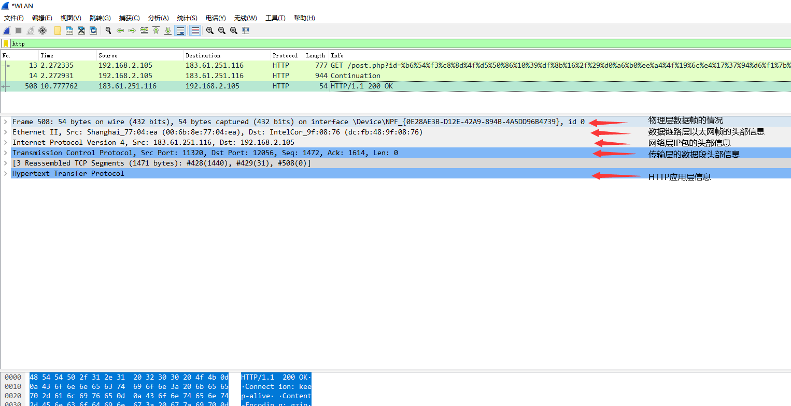
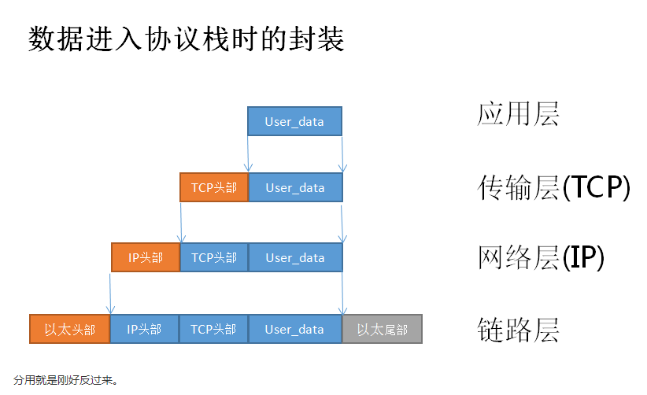
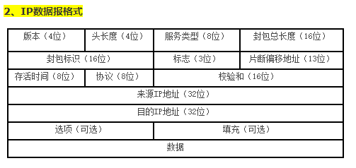
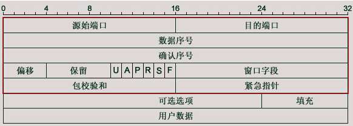
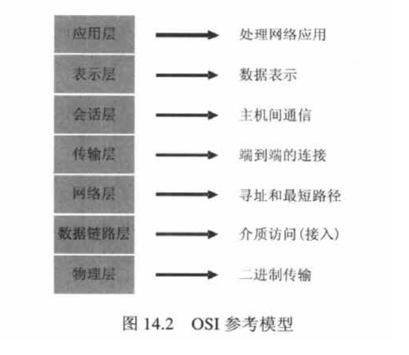
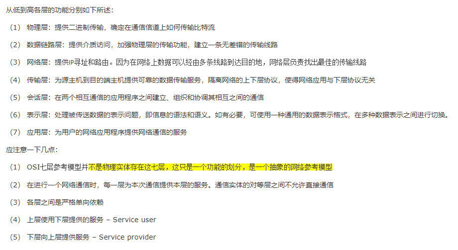
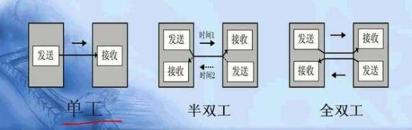

# Wireshark网络数据包分析-计算机网络

> 网络数据包的分析对于网络安全数据分析来说还是比较重要的，所以必须学习，与此同时也能把网络学好。

## TCPIP Protocol

## 数据帧、数据包、数据段

* | 起始点和目的点
:-: | :-:
数据帧 | 数据链路层
数据包 | 网络层
数据段 | 传输层

物理层数据帧的情况
数据链路层以太网帧的头部信息
网络层IP包的头部信息
传输层的数据段头部信息
HTTP应用层信息

* [偏移量详解](http://www.360doc.com/content/15/0604/20/25677607_475698332.shtml)

## 计算机网络相关知识

* [网络编程的一些理论](https://www.cnblogs.com/xcywt/p/5027277.html)
* [IP协议和网络传输中的封装与分用](https://www.cnblogs.com/xcywt/p/8067521.html)
* [TCP头部分析与确认号的理解](https://www.cnblogs.com/xcywt/p/8075623.html)

6个标志位：
URG-紧急指针有效
ACK-确认序号有效
PSH-接收方应尽快将这个报文交给应用层
RST-连接重置
SYN-同步序号用来发起一个连接
FIN-终止一个连接

* Socket是连接应用程序与网络驱动程序的桥梁，Socket在应用程序中创建，通过绑定与驱动程序建立关系。应用程序给Socket的数据，由Socket交给驱动程序向网络上发送出去。
* IP地址相当于总机号码，而端口号相当于分机号码。
* 
* 

* 全双工、半双工、单工

