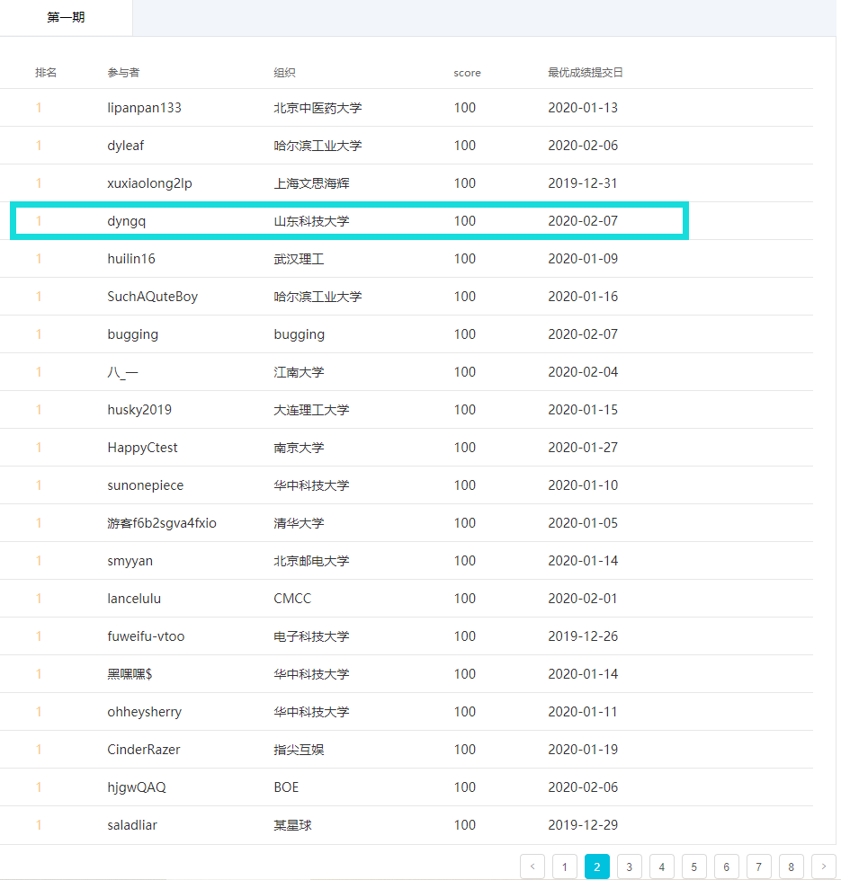

# docker 总结

> 之前大体上玩儿过，但是一直没有完整的使用过；这次借着天池的一个新人赛 [【入门】Docker练习场](https://tianchi.aliyun.com/competition/entrance/231759/introduction)，梳理了一下docke的基本操作。

## window下docker解决方案

* docker对于unix是比较友好的，无需累述；docker在windows下一直没有好的解决方案，今天花了一天的时间终于找到了最好的解决方案，并且完成了比赛。
* 的目前为止最好的解决方案还是docker for windows，之前的解决方案可能是VM、或者win10子系统WSL里的docker，wsl虽然很方便也有方法能起来docker，但是很容易碰见这样那样的问题，docker守护进程方面很难弄。之所以说docker for windows是最好的解决方案是因为他的新版本解决了对于hyper-v的依赖，使得他自己与VM等不会发生冲突，这就解决了他之前最大的弊端，使用起来没有复杂的障碍与冲突。详细的进步在[知乎：Windows下想使用Linux环境，WSL、Docker、VM应该怎么选择？](https://www.zhihu.com/question/339939686)。
* windows下安装也很简单，[Welcome to Docker Hub: Download and Take a Tutorial](https://store.docker.com/editions/community/docker-ce-desktop-windows)。
* 记得开启docker的镜像加速，不然下载镜像会很慢，可以使用阿里云的加速，[阿里云加速链接](https://cr.console.aliyun.com/cn-hangzhou/instances/mirrors)。

## 常用命令

命令 | 操作
:-: | :-:
docker images | 查看已存在镜像
docker ps | 查看正在运行的容器
docker ps -a | 查看所有容器
docker run -it [打包的镜像名称]:[tag] bash | 启动镜像
docker commit -a "dyngq" -m "test" [容器名称或id] [打包的镜像名称]:[tag] |将容器打包成镜像
docker rm | 删除容器
docker rmi | 删除镜像
docker bulid -t [打包的镜像名称]:[tag] | 根据Dockerfile打包镜像
docker start | 启动容器
docker attach | 进入容器

### 将容器打包成镜像

docker commit -a "dyngq" -m "test" [容器名称或id] [打包的镜像名称]:[tag]

-a :提交的镜像作者；
-c :使用Dockerfile指令来创建镜像；
-m :提交时的说明文字；
-p :在commit时，将容器暂停。

### Dockerfile示例

[Dockfile](./docker/tianchi_submit_demo/Dockerfile)

    # Base Images
    ## 从带有numpy的python镜像
    FROM numpy:1.0

    ## 把当前文件夹里的文件构建到镜像的根目录下
    ADD . /

    ## 指定默认工作目录为根目录（需要把run.sh和生成的结果文件都放在该文件夹下，提交后才能运行）
    WORKDIR /

    ## 镜像启动后统一执行 sh run.sh
    CMD ["sh", "run.sh"]

### 其他一些常用参考链接

* [菜鸟教程的docker教学](https://www.runoob.com/docker/docker-tutorial.html)
* pass

## 天池

> [手把手超详细操作说明](https://tianchi.aliyun.com/competition/entrance/231759/tab/174)

1. 创建阿里云的docker仓库
2. pull拉取提供的python3镜像
3. 启动镜像，在这个容器内安装numpy
4. 将安装有numpy的容器打包成镜像
5. 写好Dockerfile，写好sh和py
6. push上去
7. 提交结果

本次提交的所有文件都在./docker文件夹内

py文件

    # import pandas as pd
    import numpy as np
    import json

    # df = pd.read_csv("/tcdata/num_list.csv")
    # df = pd.read_csv("./docker/tianchi_submit_demo/data/tcdata/num_list.csv")
    # print(df)

    numbers = np.loadtxt(open("./tcdata/num_list.csv","rb"),delimiter=",",skiprows=0,dtype='int')
    # numbers = np.loadtxt(open("./docker/tianchi_submit_demo/data/tcdata/num_list.csv","rb"),delimiter=",",skiprows=0,dtype='int')

    # numbers = np.random.randint(1,30,size=50,dtype='int32')
    # print(numbers)
    # np.savetxt('./docker/tianchi_submit_demo/data/tcdata/num_list.csv', numbers,delimiter = ',')

    # print("hello_world")

    # print(numbers,type(numbers.tolist()))

    r_sum = np.sum(numbers)

    top10 = numbers[np.argpartition(numbers,-10)[-10:]]
    top10 = np.sort(top10).tolist()
    top10.reverse()
    # print(top10, type(top10))

    result = {
        "Q1": "Hello world",
        "Q2": r_sum.tolist(),
        # C004 注意：TOP10 若包含重复值
        "Q3": top10
    }
    with open("result.json", "w") as f:
        json.dump(result, f) 

