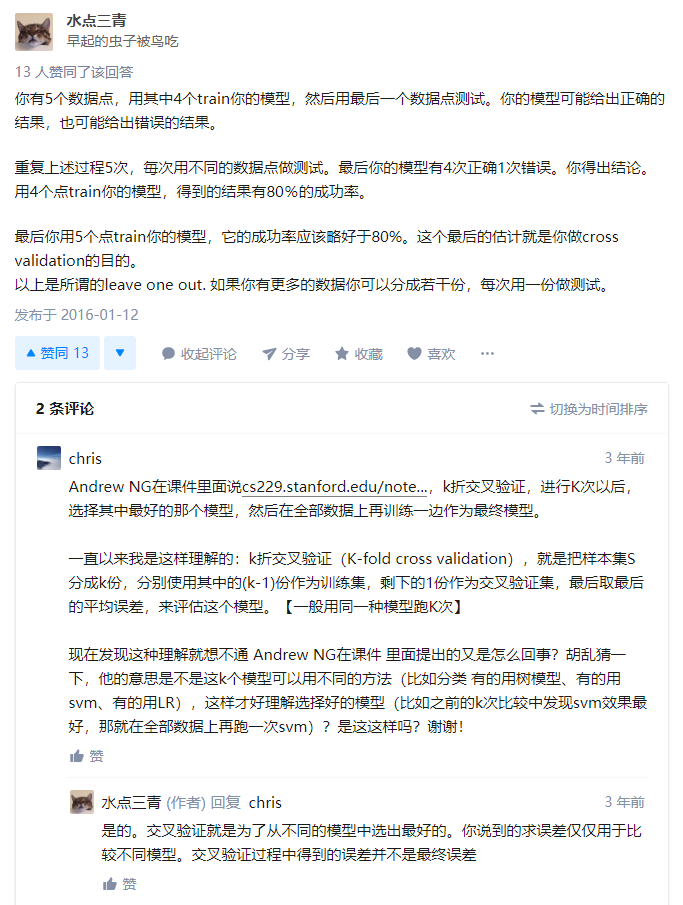

# Stacking模型融合

* 1.介绍一下stacking的原理等
* 2.机器学习算法进行stacking很常见，像mlxtend等库对stacking算法封装还不错
* 3.简单实现一下神经网络的stacking算法

#### 最经典的一张图:
* 
* 但是可以不从这个图开始理解，这个图是一个表较复杂，比较不容易过拟合的一种复杂实现，理解stacking更重要的是理解stacking总体的思想。由浅入深，先从整体上把握，再针对不同的情境复杂优化。
* stacking算法基于一个简单的思想，与其使用一些平凡的函数（比如硬投票）来聚合集成所有模型预测，那为什么不训练一个模型来执行这些聚合呢。

## 总体概述：
* stacking原则上可以分成若干层级，但层数多不一定效果越好，一般采用两层结构。
* 因此，我们可以把stacking过程看作是两个级别，级别0和级别1。
    * 0级:  也就是对应第一层，0级模型就是我们需要堆叠的多个模型，也称为**预测器**。可以是随机森林SVM等等多种模型，也可以只有一种模型。对这些模型在训练集上进行正常训练。
    * 1级:  也就是对应第二层，1级模型称为**混合器**或元学习器（blender, or a meta learner）。混合器的训练集的输入特征（x）是上一层多个预测器的预测值的拼接，混合器的训练集的预测值（y）就是训练集原来的预测值（y）。

* 
* 
* 
* stacking一般采用预留集的方法训练1级模型（元学习器），如图所示，训练集被拆分为2部分（注意，这里**不是**要几折也**不是**要拆分成训练集验证集测试集），子集1正常训练模型，得到n个预测器。让刚刚得到的n个预测器在预留集（子集2）上进行预测，（由于之前一直没有见过子集2里的数据，所以可以确保预测是干净的），这样就得到了n个预测值。将这些预测值作为输入特征，创建一个新的训练集（n维），保留原来的label作为label，在这个新的训练集上训练1级模型（元学习器/混合器），让它学习使用预测器的预测来预测目标值。

* 
* 

* 当然，就像之前说的，stacking可以有多层，比如三层。
* 第一层是预测器，第二层是多个混合器（混合器可以有多种，随机森林、线性回归等等），第三层是又一层的混合器。
* 这是就需要讲训练集分成三部分，在三层上“干净的”训练。
* 原理如下图：                                                                 
*                       

## 第二部分：下面是网上最常见的stacking方法解释(也就是文章已开始的图片所描述的)       (神经网络的stacking应用在下一部分)
#### 一种更为复杂的方法是使用k-fold交叉验证来开发元学习机模型的训练数据集，也就是对应一开始的那张图片。每个0级模型预测器都使用k-fold交叉验证(甚至为了达到最大效果使用留一法交叉验证)进行训练;然后模型被丢弃，但是预测被保留。这意味着对于每个模型，都有一个模型版本所做的预测，而这个版本的模型并没有针对这些例子进行训练，例如，有一些在预留的例子。

关于K折交叉验证

### 下面是比较好最普遍的解释（来自网上，文末链接）：
* 

对于每一轮的 5-fold，Model 1都要做满5次的训练和预测。
Titanic 栗子：
Train Data有890行。(请对应图中的上层部分）
每1次的fold，都会生成 713行 小train， 178行 小test。我们用Model 1来训练 713行的小train，然后预测 178行 小test。预测的结果是长度为 178 的预测值。
这样的动作走5次！ 长度为178 的预测值 X 5 = 890 预测值，刚好和Train data长度吻合。这个890预测值是Model 1产生的，我们先存着，因为，一会让它将是第二层模型的训练来源。
重点：这一步产生的预测值我们可以转成 890 X 1 （890 行，1列），记作 P1 (大写P)
接着说 Test Data 有 418 行。(请对应图中的下层部分，对对对，绿绿的那些框框）
每1次的fold，713行 小train训练出来的Model 1要去预测我们全部的Test Data（全部！因为Test Data没有加入5-fold，所以每次都是全部！）。此时，Model 1的预测结果是长度为418的预测值。
这样的动作走5次！我们可以得到一个 5 X 418 的预测值矩阵。然后我们根据行来就平均值，最后得到一个 1 X 418 的平均预测值。
重点：这一步产生的预测值我们可以转成 418 X 1 （418行，1列），记作 p1 (小写p)
走到这里，你的第一层的Model 1完成了它的使命。
第一层还会有其他Model的，比如Model 2，同样的走一遍， 我们有可以得到  890 X 1  (P2) 和  418 X 1 (p2) 列预测值。
这样吧，假设你第一层有3个模型，这样你就会得到：
来自5-fold的预测值矩阵 890 X 3，（P1，P2， P3）  和 来自Test Data预测值矩阵 418 X 3， （p1, p2, p3）。

-----------------------------------------

到第二层了..................
来自5-fold的预测值矩阵 890 X 3 作为你的Train Data，训练第二层的模型
来自Test Data预测值矩阵 418 X 3 就是你的Test Data，用训练好的模型来预测他们吧。

---------------------------------------

最后 ，放出一张Python的Code，在网上为数不多的stacking内容里， 这个几行的code你也早就看过了吧，我之前一直卡在这里，现在加上一点点注解，希望对你有帮助：
* 

## 第三部分：神经网络的stacking
* 有一篇专门的英文博客介绍了传统机器学习以及神经网络的stacking，文末链接。
* ------------------------------------------------------------
* 做了京东评论的情感分析，尝试使用了stacking。
* 后来毕业设计老师建议使用英文数据集，相对于中文噪声小等，所以以后还会尝试在IMDB和Twitter数据集上的复杂神经网络模型上进行stacking。
* ------------------------------------------------------------

参考资料：
* 1.最完整的，包括深度学习
    * 中文译文：https://blog.csdn.net/LaoChengZier/article/details/86504464
    * 英文原版：https://machinelearningmastery.com/stacking-ensemble-for-deep-learning-neural-networks/
* 2.https://www.leiphone.com/news/201709/zYIOJqMzR0mJARzj.html
* 3.https://blog.csdn.net/willduan1/article/details/73618677
* 4.

